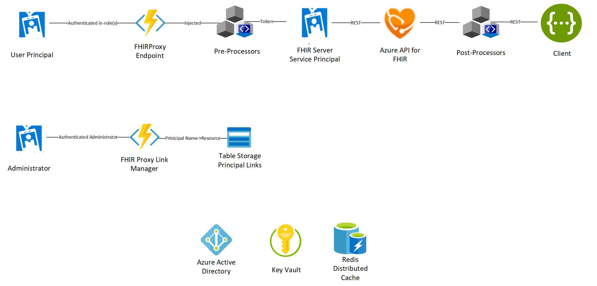

# Secure FHIR Gateway and Proxy

Secure FHIR Gateway and Proxy is an Azure Function based solution that:
 + Acts as an intelligent and secure gateway to FHIR Servers
 + Allows multi-tenant access and purpose driven security policies specialized access to a common FHIR Server
 + Provides a consolidated approach to pre and post processing of FHIR Server Calls to support various access and result filtering or actions.</br>
 + Is integrated with Azure Active Directory for authentication and to provide Role based access control.</br>
 + Acts as a FHIR specific reverse proxy rewriting responses and brokering requests to FHIR Servers</br>
## Authentication and RBAC Authorization
By default the proxy will configure and use Azure Active Directory (Azure AD) as an authentication provider.  You will also need to assign users/groups and/or service principals into specific server access roles in order to access the FHIR Server via the proxy.  You can also offload this responsibility to [API Management](https://azure.microsoft.com/en-us/services/api-management/)

## Pre and Post Processing Support
The proxy can be configured to execute any number of logic processing modules to support a variety of pre/post conditional actions on a per call basis. You can create custom processors by implementing the ```IProxyPreProcess``` or ```IProxyPostProcess``` interfaces in a thread safe class.
The modules are executed in a chained fashion determined by configured order.  Context is continually updated so the last result is passed to the next member of the processor chain resulting in a fully processed/filtered request or post-processing result.  Any configured module can stop the chain progression by issuing a do not continue command.

The base pre and post processing modules included and can be configured are:
 + ParticipantFilterPostProcess - This processing module will filter returned resources linked to a patient to only include patients where you are the patient or are a "Practitioner of Record" (e.g. in a participant role) Note: this only filters patient based linked resources. You can use this module as a basis for building your own security filtering</br>
 + PublishFHIREventPostProcess - This processing module will publish FHIR Creata-Update-Delete (CUD) events for resources to a configured eventhub.  These events can be subscribed too by any number of consumers in order to facilitate any number of orchestrated workflows. (e.g. CDS, Audits, Alerts, etc...)</br>
 + TransformBundlePreProcess - This processing module will transform incoming transaction bundle requests into batch bundle request and maintain UUID associations of contained resources.  This is a alternative for updating FHIR Servers unable to handle transaction based requests.</br>
 + DateSortPostProcessor - This processing module allows for date based sorting alternative on FHIR Servers that do not natively support _sort. The processor implements top level _sort=date or _sort=-date parameter for supported resources queries up to a configured maximum number of rows.</br>  
 + ConsentOptOutFilter - This post-processing module adds the ability to deny access to FHIR Server resources for patients who have elected to OPTOUT everyone or specific individuals and/or organizations from access to their medical data.
 + EverythingPatientPreProcess - This pre-preocessing module implements a limited $everything at the patient level. It returns up to 5000 related resources for the Patient

A __SamplePreProcess__ and __SamplePostProcess__ are available in the project folders <b>```FHIRProxy/preprocessors```</b> and <b>```FHIRProxy/postprocessors```</b> </br>
 
See [Configuration](docs/configuration.md) document for full descriptions and configuration instructions.

## Reverse Proxy
All FHIR Server responses are re-written to include the proxy address as the appropriate endpoint so the FHIR Server URL is never directly exposed.

## Architecture Overview



## Deploying your own FHIR Proxy
Please note you should deploy this proxy into a tenant that you have appropriate permissions to create and manage Application Registrations, Enterprise Applications, Permissions and Role Definitions Assignments

_For detailed instructions please read this document_ **[./scripts/Readme.md](./scripts/Readme.md)**

Launch Azure Cloud Shell (Bash Environment)  
  
[](https://shell.azure.com/bash?target="_blank")

Clone the repo to your Bash Shell (CLI) environment 
```azurecli-interactive
git clone https://github.com/microsoft/fhir-proxy 
```
Change working directory to the repo Scripts directory
```azurecli-interactive
cd ./fhir-proxy/scripts
```

Make the Bash Shell Scripts used for Deployment and Setup executable 
```azurecli-interactive
chmod +x *.bash 
```

Run the <b>```deployfhirproxy.bash```</b> script and follow the prompts
```azurecli
./deployfhirproxy.bash 
```

Run the <b>```createProxyServiceClient.bash```</b> script and follow the prompts 
```azurecli
./createProxyServiceClient.bash
```

Congratulations you now have a Secure FHIR Proxy instance with authentication running. You can now add users/groups for authorized access (see below)

## Proxy Endpoint
The new endpoint for your FHIR Server should now be: <b>```https://<secure proxy url from above>/fhir/```</b>. You can use any supported FHIR HTTP verb and any FHIR compliant request/query
For example to see conformance statement for the FHIR Server, use your browser and access the proxy endpoint:</br>
<b>```https://<secure proxy url from above>/fhir/metadata```</b>

Proxy endpoints will authenticate/authorize your access to the FHIR server will execute configured pre-processing routines, pass the modified request on to the FHIR Server via the configured service client, execute configured post-processing routines on the result and rewrite the server response to the client. 
The original user principal name and tenant are passed in custom headers to the FHIR server for accurate security and compliance auditing.  


## Additional Documentation 

### [Adding Users/Groups to the FHIR Server Proxy](docs/addingusers.md)
At a minimum users must be placed in one or more FHIR server roles in order to access the FHIR Server via the Proxy. The Access roles are Administrator, Resource Reader and Resource Writer 

### [Adding Application Service Principals to the FHIR Server Proxy](docs/addingappsvcprincipals.md)
You can create service client principals and register for Application API Access to the proxy. This is useful for using the proxy in machine driven service workflows where a human cannot sign-in. </br>

### [Configuration](docs/configuration.md)
The FHIR Proxy is configured on installation to be paired to a FHIR Server via a service client.  Default roles are added to the application and are configured for specific access in configuration settings section of the function app.

### [Enabling Pre/Post Processing Modules](docs/configuration.md)
By default, no pre/post processors are configured to run.  You will need to enable and configure them following the steps outlined in the [congiruation](docs/configuration.md) document. 

### [Date Sort Post-Processor](docs/configuration.md)
This post process allows for date based sorting alternative on FHIR Servers that do not natively support _sort. The processor implements top level _sort=date or _sort=-date (reverse chron) query parameter for supported resource queries up to a hard maximum of 5000.</br>
 
### [Publish Event Post-Processor](docs/configuration.md)
This processor will publish FHIR Server Create/Update and Delete events for affected resources to a configured eventhub. These events can be subscribed to by any number of consumers in order to facilitate any number of orchestrated workflows. (e.g. Clinical Decision Support, Audits, Alerts, etc...)</br>

### [Transform Bundle Pre-Processor](docs/configuration.md)
This processing module will transform incoming transaction bundle requests into batch bundle request and maintain UUID associations of contained resources.  This is a alternative for updating FHIR Servers unable to handle transaction based requests.</br>

### [Participant Filter Post-Processor](docs/configuration.md)
This module will filter returned resources linked to a patient to only include patients where you are the patient or are a "Practitioner of Record" (e.g. in a participant role) Note: this only filters patient based linked resources. You can use this module as a basis for building your own security filtering</br>

### [Consent Opt-Out Filter](docs/configuration.md)
This module adds the ability to deny access to FHIR Server resources for patients who have elected to OPTOUT everyone or specific individuals and/or organizations from access to their medical data.

### [Everything Patient Pre Processor](docs/configuration.md)
This pre-preocessing module implements a limited $everything at the patient level. It returns the Patient and up to 5000 related resources for the Patient. Paging or other query parameters are not currently supported.


## Contributing

This project welcomes contributions and suggestions.  Most contributions require you to agree to a
Contributor License Agreement (CLA) declaring that you have the right to, and actually do, grant us
the rights to use your contribution. For details, visit https://cla.opensource.microsoft.com.

When you submit a pull request, a CLA bot will automatically determine whether you need to provide
a CLA and decorate the PR appropriately (e.g., status check, comment). Simply follow the instructions
provided by the bot. You will only need to do this once across all repos using our CLA.

This project has adopted the [Microsoft Open Source Code of Conduct](https://opensource.microsoft.com/codeofconduct/).
For more information see the [Code of Conduct FAQ](https://opensource.microsoft.com/codeofconduct/faq/) or
contact [opencode@microsoft.com](mailto:opencode@microsoft.com) with any additional questions or comments.

FHIR® is the registered trademark of HL7 and is used with the permission of HL7.
