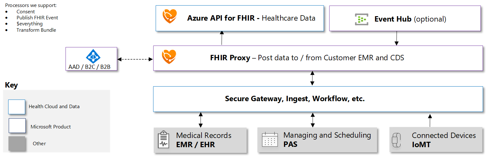

# Secure FHIR Gateway and Proxy

Secure FHIR Gateway and Proxy is an Azure Function based solution that:
 + Acts as an intelligent and secure gateway to FHIR Servers
 + Allows multi-tenant access and purpose driven security policies specialized access to a common FHIR Server
 + Provides a consolidated approach to pre and post processing of FHIR Server Calls to support various access and result filtering or actions.</br>
 + Is Integrated with Azure Active Directory for authentication and to provide Role based access control.</br>
 + Acts as a FHIR specific reverse proxy rewriting responses and brokering requests to FHIR Servers</br>
## Authentication and RBAC Authorization
By default the proxy will configure and use Azure Active Directory (Azure AD) as an authentication provider.  You will also need to assign users/groups and/or service principals into specific server access roles in order to access the FHIR Server via the proxy.  You can also offload this responsibility to [API Management](https://azure.microsoft.com/en-us/services/api-management/)

## Pre and Post Processing Support
The proxy can be configured to execute any number of logic processing modules to support a variety of pre/post conditional actions on a per call basis. You can create custom processors by implementing the ```IProxyPreProcess``` or ```IProxyPostProcess``` interfaces in a thread safe class.
The modules are executed in a chained fashion determined by configured order.  Context is continually updated so the last result is passed to the next member of the processor chain resulting in a fully processed/filtered request or post-processing result.  Any configured module can stop the chain progression by issuing a do not continue command.

The base pre and post processing modules included and can be configured are:
 + ParticipantFilterPostProcess - This processing module will filter returned resources linked to a patient to only include patients where you are the patient or are a "Practitioner of Record" (e.g. in a participant role) Note: this only filters patient based linked resources. You can use this module as a basis for building your own security filtering</br>
 + PublishFHIREventPostProcess - This processing module will publish FHIR CUD events for resources to a configured eventhub.  These events can be subscribed too by any number of consumers in order to facilitate any number of orchestrated workflows. (e.g. CDS, Audits, Alerts, etc...)</br>
 + TransformBundlePreProcess - This processing module will transform incoming transaction bundle requests into batch bundle request and maintain UUID associations of contained resources.  This is a alternative for updating FHIR Servers unable to handle transaction based requests.</br>
 + DateSortPostProcessor - This processing module allows for date based sorting alternative on FHIR Servers that do not natively support _sort. The processor implements top level _sort=date or _sort=-date parameter for supported resources queries up to a configured maximum number of rows.</br>  
 + ProfileValidationPreProcess - This processing module adds the ability to call external profile (e.g. [US Core](https://www.hl7.org/fhir/us/core/)) and/or standard schema validation support for FHIR Servers who do not implement or support specific profile validation.
 + ConsentOptOutFilter - This post-processing module adds the ability to deny access to FHIR Server resources for patients who have elected to OPTOUT everyone or specific individuals and/or organizations from access to their medical data.
 + EverythingPatientPreProcess - This pre-preocessing module implements a limited $everything at the patient level. It returns up to 5000 related resources for the Patient

Check back often as more processing modules will be added. </br>
 
See [Proxy Configuration](##configuration) section below for full descriptions and configuration instructions.
## Reverse Proxy
All FHIR Server responses are re-written to include the proxy address as the appropriate endpoint so the FHIR Server URL is never directly exposed.

## Architecture Overview



## Deploying your own FHIR Proxy

Please note you should deploy this proxy into a tenant that you control Application Registrations, Enterprise Applications, Permissions and Role Definitions Assignments

1. [Get or Obtain a valid Azure Subscription](https://azure.microsoft.com/en-us/free/)</br>
   _Note:Skip to Step 5 if you already have a FHIR Server/Service Client deployed_
2. [Deploy an Azure API for FHIR instance](https://docs.microsoft.com/en-us/azure/healthcare-apis/fhir-paas-portal-quickstart)
3. [Register a Service Client to Access the FHIR Server](https://docs.microsoft.com/en-us/azure/healthcare-apis/register-service-azure-ad-client-app).
4. [Find the Object Id for the Service Client and Register it with the FHIR Server](https://docs.microsoft.com/en-us/azure/healthcare-apis/find-identity-object-ids)
5. You will need the following information to configure the Secure FHIR Proxy 
   + Client/Application ID for the FHIR Service Client
   + The Client Secret for the FHIR Service Client
   + The AAD Tenant ID for the FHIR Server/Service Client
   + The Audience/Resource for the FHIR Server/Service Client typically https://<I>[yourfhirservername]</I>.azurehealthcareapis.com for Azure API for FHIR
6. [Open Azure Cloud Shell](https://shell.azure.com) you can also access this from [azure portal](https://portal.azure.com)
7. Select Bash Shell 
8. Clone this repo ```git clone https://github.com/microsoft/health-architectures```
9. Switch to the FHIR/FHIRproxy subdirectory of this repo ```cd FHIR/FHIRProxy```
10. Run the ```deployfhirproxy.bash``` script and follow the prompts
11. Congratulations you now have a Secure FHIR Proxy instance with authentication running. You can now add users/groups for authorized access (see below)

# Proxy Endpoint
The new endpoint for your FHIR Server should now be: ```https://<secure proxy url from above>/api/fhirproxy```. You can use any supported FHIR HTTP verb and any FHIR compliant request/query
For example to see conformance statement for the FHIR Server, use your browser and access the following endpoint:</br>
```https://<secure proxy url from above>/api/fhirproxy/metadata```

The endpoint will authenticate/authorize your access to the FHIR server will execute configured pre-processing routines, pass the modified request on to the FHIR Server via the configured service client, execute configured post-processing routines on the result and rewrite the server response to the client. 
The original user principal name and tenant are passed in custom headers to the FHIR server for accurate security and compliance auditing.  
_Note: You will need to login as a user/principal in a FHIR Reader and/or FHIR Administrative role to view. All proxy calls are auth secured including conformance_


## Adding Users/Groups to the FHIR Server Proxy
At a minimum users must be placed in one or more FHIR server roles in order to access the FHIR Server via the Proxy. The Access roles are Administrator, Resource Reader and Resource Writer 
1. [Login to Azure Portal](https://portal.azure.com) _Note: If you have multiple tenants make sure you switch to the directory that contains the Secure FHIR Proxy_
2. [Access the Azure Active Directory Enterprise Application Blade](https://ms.portal.azure.com/#blade/Microsoft_AAD_IAM/StartboardApplicationsMenuBlade/AllApps/menuId/)
3. Change the Application Type Drop Down to All Applications and click the Apply button
4. Enter the application id or application name from above in the search box to locate the Secure FHIR Proxy application
5. Click on the Secure FHIR Proxy application name in the list
6. Click on Users and Groups from the left hand navigation menu
7. Click on the +Add User button
8. Click on the Select Role assignment box
9. Select the access role you want to assign to specific users
   The following are the predefined FHIR Access roles:
   + Administrator - Full Privileges to Read/Write/Link resource to the FHIR Server
   + Resource Reader - Allowed to Read Resources from the FHIR Server
   + Resource Writer - Allowed to Create, Update, Delete Resources on the FHIR Server
  
    When the role is selected click the select button at the bottom of the panel

10. Select the Users assignment box
11. Select and/or Search and Select registered users/guests that you want to assign the selected role too.
12. When all users desired have been selected click the select button at the bottom of the panel.
13. Click the Assign button.
14. Congratulations the select users have been assigned the access role and can now perform allowed operations against the FHIR Server

## Adding Application Service Principals to the FHIR Server Proxy
You can create service client principals and register for Application API Access to the proxy. This is useful for using the proxy in machine driven service workflows where a human cannot sign-in. </br>
The FHIR Server Roles assignable to applications by default are: Resource Reader and Resource writer. You may add/change application assignable roles in the FHIR Proxy application manifest.
 
1. [Login to Azure Portal](https://portal.azure.com) _Note: If you have multiple tenants make sure you switch to the directory that contains the Secure FHIR Proxy_
2. [Register a new Application (Service Principal) with Azure Active Directory](https://docs.microsoft.com/en-us/azure/active-directory/develop/quickstart-register-app)
3. Create a new client secret note what it is and keep it secure.
4. Click on the API Permissions left on the left hand navigation menu
5. Click on the under Configured Permissions, Click + Add a Permission
6. On the Request API Permissions tab Click on the APIs my organization uses button
7. In the search box enter the name of your FHIR Proxy (e.g. myproxy.azurewebsites.net)
8. Choose your proxy registration from the list
9. Click on the Application Permissions Box
10. Select the Roles you want this principal to be assigned in the Proxy (Reader, Writer or Both)
11. Click the Add Permissions box at the bottom to commit
12. On the Configured permissions area you will need Administrator rights to Grant Administrator consent to the roles you assigned
13. Once granted the service principal will now have access to the proxy in the roles you assigned.
14. You can verify this by looking at the Enterprise Application blade for the proxy under user and group assignments you will see the service principal

Note: You can authenticate using client_credentials flow to your new application using it's application id and secret, the resource or audience should be the application id of the FHIR proxy.  Pass the obtained token in the Authorization header of your calls to the FHIR proxy.

##  Configuration
The FHIR Proxy is configured on installation to be paired to a FHIR Server via a service client.  Default roles are added to the application and are configured for specific access in configuration settings section of the function app.
Enablement of pre/post processing modules is accomplished via the ```configmodules.bash``` utility.</br>

Important:  Most pre/post processing modules will require additional [configuration](https://docs.microsoft.com/en-us/azure/azure-functions/functions-how-to-use-azure-function-app-settings) after enablement, in order to function. Please check the details of the module for instructions.

## Enabling Pre/Post Processing Modules
By default, no pre/post processors are configured to run.  You will need to enable and configure them following the steps below:

1. [Open Azure Cloud Shell](https://shell.azure.com) you can also access this from [azure portal](https://portal.azure.com)
2. Select Bash Shell 
3. Clone this repo (if needed) ```git clone https://github.com/microsoft/health-architectures```
4. Switch to the FHIR/FHIRproxy subdirectory of this repo ```cd FHIR/FHIRProxy```
5. Run the ```configmodules.bash``` script and follow the prompts to launch the selector
5. Select the option number of a module to enable it (select it again to disable)
6. To accept and configure selected processors press ENTER


Note the utility does not read current configuration it will simply enable the modules you specify and update the function configuration. To disable all modules press enter without selecting options.  To escape menu selection and abort updates press CTRL-C 

## Date Sort Post-Processor
This post process allows for date based sorting alternative on FHIR Servers that do not natively support _sort. The processor implements top level _sort=date or _sort=-date (reverse chron) query parameter for supported resource queries up to a hard maximum of 5000.</br>
The resources supported for top level_sort=date are: Observation,DiagnosticReport,Encounter,CarePlan,CareTeam,EpisodeOfCare and Claim. Any other resources will be ignored and not sorted.</br>
This processor is limited to process 5000 resource entries in a search-set bundle, it is imperative that you limit your query to not exceed this many resources for accurate results.
This processor also has the potential to cause server delays in responses for large results sets use with caution.  <I>Hints: Specify large _count parameter value to reduce calls to server and select limiting parameters for resource queries.</I>
A log warning will be issued for request that exceed the 5000 resource sort limit, but no error response will be returned just the truncated data set</br>
This process requires no additional configuration.  

## Publish Event Post-Processor
This processor will publish FHIR Server Create/Update and Delete events for affected resources to a configured eventhub.  These events can be subscribed too by any number of consumers in order to facilitate any number of orchestrated workflows. (e.g. CDS, Audits, Alerts, etc...)</br>
In addition to the action date the eventhub message consists of the following information:
+ Action - HTTP Verb used to modify the FHIR Server
+ Resourcetype - The type of resource affected (e.g. Patient, Observation, etc...)
+ Id - The resource logical id on the FHIR Server that was affected.
+ Version Id - The version number of the resource affected
+ LastUpdated - The date/time the affected resource was updated.

You can use the data in the eventhub message to make decisions and get affected resource information to facilitate CDS or other workflows.

This process requires two configuration settings on the function app:
```
     FP-MOD-EVENTHUB-CONNECTION: <A valid EventHub namespace connection string>
     FP-MOD-EVENTHUB-NAME: <A valid event hub in the specified event hub namespace connection>
```

## Profile Validation Pre-Processor
This processor adds the ability to call external profile and/or standard FHIR schema validation support for FHIR Servers who do not implement or support specific profile validation.
This module expects external validation URLs to return an [OperationOutcome](https://www.hl7.org/fhir/operationoutcome.html) FHIR Resource.  The presence of issue entries will abort pre-processing and the FHIR Server call and the outcome will be returned to the client for resolution.
Enforcement is via a profile enforecement policy file (detailed below)

This process requires the following configuration settings on the function app:
```
    FP-MOD-FHIRVALIDATION-URL:<A valid URL to a compliant FHIR Validation Server>
    FP-MOD-FHIRVALIDATION-POLICY-CONTAINER:<A valid container name in the FHIR Proxy Storage Account that contains profile enforcement file (Default is: fhirvalidator)>
    FP-MOD-FHIRVALIDATION-POLICY-FILE:<A valid file name of profile enforcement policy file (Default is: profile_enforce_policy.json)>
```

<B>Profile Enforcement Policy File</B>
The profile enforcement policy file is a JSON Document Object that allows you to define by resource type the profiles that the resource should be validated against before allowing write commits to your FHIR Server. The structure of the JSON Object in the file should be:
```
{ 
    "enforce":[
	    { 
		    "resource":"<resource type>",
		    "profiles":[	
	            "<structure definition url>"
		    ]
	    }
    ]
}
```
For example the following file would enforce us-core-patient for Patient resources and us-core-condition for Condition resources:
```
{ 
	"enforce":[
		{ 
			"resource":"Patient",
			"profiles":[	
				"http://hl7.org/fhir/us/core/StructureDefinition/us-core-patient"
			]
		},
        { 
			"resource":"Condition",
			"profiles":[	
				"http://hl7.org/fhir/us/core/StructureDefinition/us-core-condition"
			]
		}
	]
}
```

You may have multiple profiles per resource that are to be validated.  
The proxy server will send these profiles as a collection of profile parameters on the query string to the FHIR Valadation server.
For example:
```
https://<your validation server url>?profile=profileurl1&profile=profileurl2
```


If the policy file is not present or malformed the proxy server will call the FHIR Validator without specific profiles and the resource will be validated against R4 schema only.

The health-architectures [FHIR Validator](https://github.com/microsoft/health-architectures/tree/master/FHIR/FHIRValidator) provides a Docker wrapped version of the org.hl7 FHIR Validator and can be used with this processor.  It supports FHIR R4 and [US Core](https://www.hl7.org/fhir/us/core/) profiles.
For example to validate a Patient resource for US Core compliance you would configure the Profile Enforcement Policy file for the Patient resource and then call the proxy with POST/PUT with the resource in the message body using the following url:

```
https://<secure proxy url from above>/api/fhirproxy/Patient

```


The validator also supports batch or transaction bundles as well analyzing each contained resource.  

## Transform Bundle Pre-Processor
This processing module will transform incoming transaction bundle requests into batch bundle request and maintain UUID associations of contained resources.  This is a alternative for updating FHIR Servers unable to handle transaction based requests.</br>
This processor will maintain internal logical id references when converted to batch mode, however, no transaction support will be included (e.g. Rollback for errors).  It will be the client responsibility to address any referential integrity or data issues that arise from server errors. Success or error status can be obtained using the batch-response bundle response.

This processor requires no additional configuration.


## Participant Filter Post-Processor
This module will filter returned resources linked to a patient to only include patients where you are the patient or are a "Practitioner of Record" (e.g. in a participant role) Note: this only filters patient based linked resources. You can use this module as a basis for building your own security filtering</br>


## How the Participant Post Processor works


## Configuring Participant Authorization Roles for Users
At a minimum users must be placed in one or more FHIR Participant roles in order to appropriately filter results from the FHIR Server. The Access roles are Patient, Practitioner and RelatedPerson. _Note:The user must also be in an appropriate Access role defined above_
1. [Login to Azure Portal](https://portal.azure.com) _Note: If you have multiple tenants make sure you switch to the directory that contains the Secure FHIR Proxy_
2. [Access the Azure Active Directory Enterprise Application Blade](https://ms.portal.azure.com/#blade/Microsoft_AAD_IAM/StartboardApplicationsMenuBlade/AllApps/menuId/)
3. Change the Application Type Drop Down to All Applications and click the Apply button
4. Enter the application id from above in the search box to locate the Secure FHIR Proxy application
5. Click on the Secure FHIR Proxy application in the list
6. Click on Users and Groups from the left hand navigation menu
7. Click on the +Add User button
8. Click on the Select Role assignment box
9. Select the access role you want to assign to specific users
   The following are the predefined FHIR Access roles:
   + Patient - This user is a patient and is linked to a Patient resource in the FHIR Server
   + Practitioner - This user is a practitioner and is linked to a Practitioner resource in the FHIR Server
   + RelatedPerson - This user is a relative/caregiver to a patient and is linked to a RelatedPerson resource in the FHIR Server
    
   When the role is selected click the select button at the bottom of the panel
10. Select the Users assignment box
11. Select and/or Search and Select registered users/guests that you want to assign the selected role too.
12. When all users desired have been selected click the select button at the bottom of the panel.
13. Click the Assign button.
14. Congratulations the select users have been assigned the participant role and can now be linked to FHIR Resources
[]()
## Linking Users in Participant Roles to FHIR Resources
1. Make sure you have configured Participant Authorization Roles for users
2. Obtain the FHIR Resource Id you wish to link to a AAD User principal.  Note you can use any search methods for the resources described in the FHIR specification.  It is strongly recommended to use a known Business Identifier in your query to ensure a specific and correct match.
   For example:
   To find a specific Patient in FHIR with a MRN of 1234567 you could issue the following URL in your browser:
   
   ```https://<your fhir proxy url>/api/fhirproxy/Patient?identifier=1234567```
   
   To find a specific Practitioner with last name Smith, in this case you can use other fields to validate like address, identifiers,etc... 
   ```https://<your fhir proxy address>/api/fhir/Practitioner?name=smith```
    
   The resource id is located in the id field of the returned resource or resource member in a search bundle
   ```"id": "3bdaac8f-5c8e-499d-b906-aab31633337d"``` 
 
   _Note: You will need to login as a user in a FHIR Reader and/or FHIR Administrative role to view._
 
 3. You will need to obtain the participant user principal name for the AAD instance in your tenant that are assigned and in roles for the secure proxy application.  Make sure the Role they are in corresponds to the FHIR Resource you are linking. 
    For example: ```somedoctor@sometenant.onmicrosoft.com```
 4. Now you can link the FHIR Resource to the user principal name by entering the following URL in your browser:
 
    ```https://<your fhir proxy url>/api/manage/link/<ResourceName>/<ResourceID>?name=<user principal name>``` 

    For example to connect Dr. Mickey in my AAD tenant principal who’s user name is mickey@myaad.onmicrosoft.com to the FHIR Practitioner Resource Id 3bdaac8f-5c8e-499d-b906-aab31633337d you would enter the following URL:
    ```https://<your fhir proxy url>/api/manage/link/Practitioner/3bdaac8f-5c8e-499d-b906-aab31633337d?name=mickey@myaad.onmicrosoft.com```
     
    _Note: You will need to login as a user in a FHIR Administrative role to perform the assignment_

5.  Your done the principal user is now connected in role to the FHIR resource.

## Consent Opt-Out Filter

This module adds the ability to deny access to FHIR Server resources for patients who have elected to OPTOUT everyone or specific individuals and/or organizations from access to their medical data.

This module operates on the access policy that the health information of patients is accessabile automatically to authorized users, but the patient can opt out completely.

It will honor any opt-out consent record(s) effective period, deny access to everyone or specific Organizations, Practitioners, RelatedPersons and Patients (Actors)

This module will only filter if the appropriate OPT-OUT Consent Resources are stored in the FHIR Server and are in force.

For Example:
The following consent resource will not allow any individuals affiliated with the specified organization (66fa407d-d890-43a5-a6e3-eb82d3bfa393) access to any resources on the FHIR Server that are related to Patient (9ec3be2f-342c-4cb6-b2dd-c124747ef1bb) for the period 4/20/2020->12/31/2020:
```
{
    "resourceType": "Consent",
    "id": "7d044901-068e-470d-ac98-8f3889144476",
    "meta": {
        "versionId": "2",
        "lastUpdated": "2020-07-24T16:02:42.802+00:00"
    },
    "text": {
        "status": "generated",
        "div": "<div xmlns=\"http://www.w3.org/1999/xhtml\"><p>Patient wishes to withhold disclosure of all data from a timeframe to any provider.\n</p>\n</div>"
    },
    "status": "active",
    "scope": {
        "coding": [
            {
                "system": "http://terminology.hl7.org/CodeSystem/consentscope",
                "code": "patient-privacy"
            }
        ]
    },
    "category": [
        {
            "coding": [
                {
                    "system": "http://loinc.org",
                    "code": "59284-0"
                }
            ]
        }
    ],
    "patient": {
        "reference": "Patient/9ec3be2f-342c-4cb6-b2dd-c124747ef1bb"
    },
    "dateTime": "2020-05-18",
    "organization": [
        {
            "reference": "Organization/66fa407d-d890-43a5-a6e3-eb82d3bfa393"
        }
    ],
    "sourceAttachment": {
        "title": "Withhold records for time frame"
    },
    "policyRule": {
        "coding": [
            {
                "system": "http://terminology.hl7.org/CodeSystem/consentpolicycodes",
                "code": "hipaa-restrictions"
            }
        ]
    },
    "provision": {
        "type": "deny",
        "period": {
            "start": "2020-04-20T00:00:00.0000+05:00",
            "end": "2020-12-31T23:59:00.0000+05:00"
        },
        "actor": [
            {
                "role": {
                    "coding": [
                        {
                            "system": "http://terminology.hl7.org/CodeSystem/v3-ParticipationType",
                            "code": "CST"
                        }
                    ]
                },
                "reference": {
                    "reference": "Organization/66fa407d-d890-43a5-a6e3-eb82d3bfa393"
                }
            }
        ]
    }
}
```
Notes: 
+ If no Period is specified the Consent provision will be deemed in force.  If no start date is specified the default will be the earliest supported date/time.  If no end date is specified the default will be the latest supported date/time.
+ If no Actors are specified in the Consent Provision all individuals will be prevented from access
+ If the user is not linked to a FHIR resource and specific actors are specified in the opt-out consent record, the filter will be unable to determine exclusion and will be allowed access be default policy
+ Organization is determined by the linked resource association with an organization.
+ If multiple consent records are present the most restrictive policy will be used and actor filters will be aggregated.
+ This filter only covers access updates are permitted to protect recorded data.
+ This filter does not allow exceptions on specific resources all resources related to the patient are filtered
 
This process requires configuration settings on the function app:
```
    FP-MOD-CONSENT-OPTOUT-CATEGORY:<A valid CodeableConcept search string to load access consent records>
```

The recommended value for category in your consent records is LOINC code 59284-0 Consent Document the parameter value would be:
```http://loinc.org|59284-0```

It is also required that users be linked to FHIR Participant roles/resources. Please see the [Linking Users in Participant Roles to FHIR Resources]() section in the Participant Access Filter Module above.

## Everything Patient Pre Processor
This pre-preocessing module implements a limited $everything at the patient level. It returns the Patient and up to 5000 related resources for the Patient. Paging or other query parameters are not currently supported.

<I>Notes:</br> This module is provided as a building block example if used in production, returned resource limitation of 5000 should be noted to end users</br>This module should be executed after all request modifying pre-preocessors since it will call the FHIR server and stop execution of other pre-processors</I>


## Contributing

This project welcomes contributions and suggestions.  Most contributions require you to agree to a
Contributor License Agreement (CLA) declaring that you have the right to, and actually do, grant us
the rights to use your contribution. For details, visit https://cla.opensource.microsoft.com.

When you submit a pull request, a CLA bot will automatically determine whether you need to provide
a CLA and decorate the PR appropriately (e.g., status check, comment). Simply follow the instructions
provided by the bot. You will only need to do this once across all repos using our CLA.

This project has adopted the [Microsoft Open Source Code of Conduct](https://opensource.microsoft.com/codeofconduct/).
For more information see the [Code of Conduct FAQ](https://opensource.microsoft.com/codeofconduct/faq/) or
contact [opencode@microsoft.com](mailto:opencode@microsoft.com) with any additional questions or comments.

FHIR® is the registered trademark of HL7 and is used with the permission of HL7.
