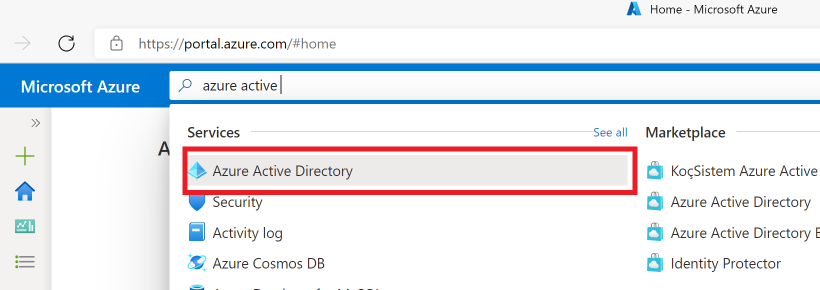
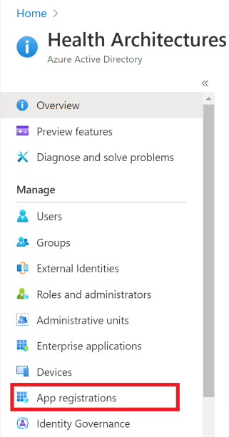
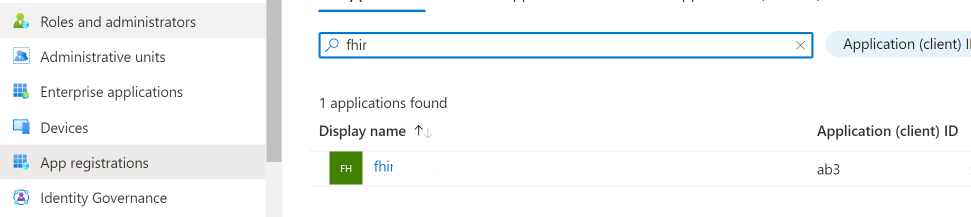
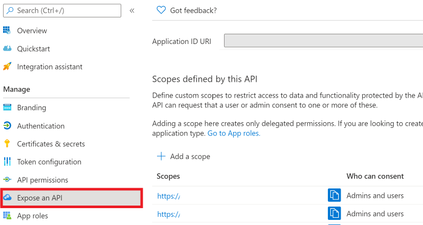
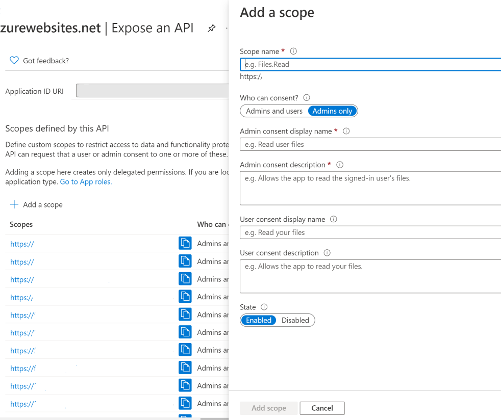
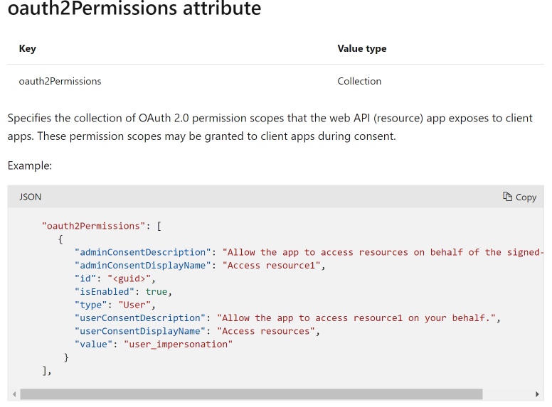

# Secure FHIR Gateway and Proxy - OAuth 2.0 Scopes Guide
## Introduction
In order to support the SMART on FHIR authorization scheme, the FHIR Proxy relies upon the OAuth 2.0 capabilities provided by Azure Active Directory. This document describes how to configure the FHIR Proxy resource application registration to enable OAuth 2.0 SMART scopes.

## Create OAuth 2.0 SMART scopes using Azure Portal
1. Log into the Azure portal <https://portal.azure.com> and search for "Azure Active Directory":

2. Select **App registrations**:

3. Select the App registration that corresponds to FHIR Proxy:

4. Select **Expose an API**:

5. Click on **Add a scope**:

6. Complete the required fields. Create as many scopes as required to support your SMART on FHIR application.

## Configure OAuth 2.0 SMART scopes in FHIR Proxy's application manifest

Information about configuring OAuth 2.0 scopes directly in an application manifest can be found [here](https://docs.microsoft.com/en-us/azure/active-directory/develop/reference-app-manifest). Shown below is a sample oauth2Permissions attribute key/value pair.

## Additional Information

### Azure Active Directory Links

[Application types for the Microsoft identity platform](https://docs.microsoft.com/en-us/azure/active-directory/develop/v2-app-types)

[OAuth 2.0 and OpenID Connect protocols on the Microsoft identity platform](https://docs.microsoft.com/en-us/azure/active-directory/develop/active-directory-v2-protocols)

[Quickstart: Register an application with the Microsoft identity platform](https://docs.microsoft.com/en-us/azure/active-directory/develop/quickstart-register-app)

[Permissions and consent in the Microsoft identity platform](https://docs.microsoft.com/en-us/azure/active-directory/develop/v2-permissions-and-consent)

[How to remove an application registered with the Microsoft identity platform](https://docs.microsoft.com/en-us/azure/active-directory/develop/howto-remove-app)