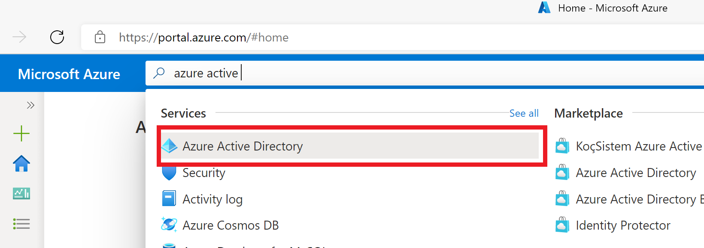
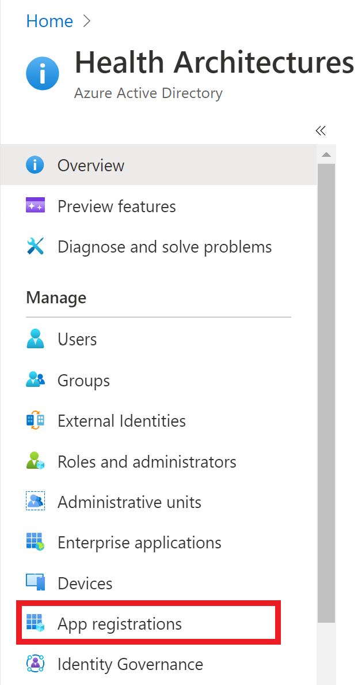
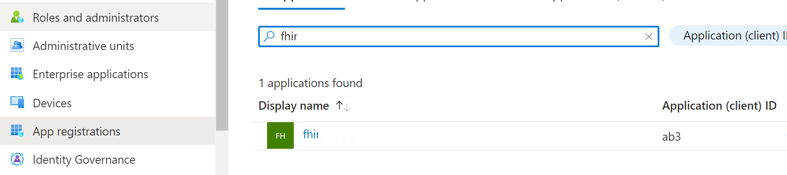
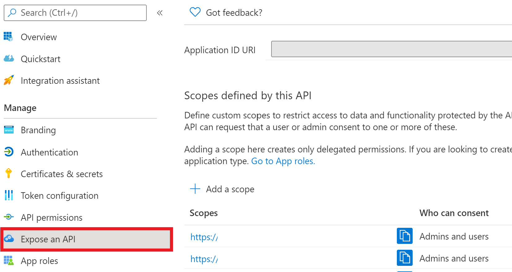
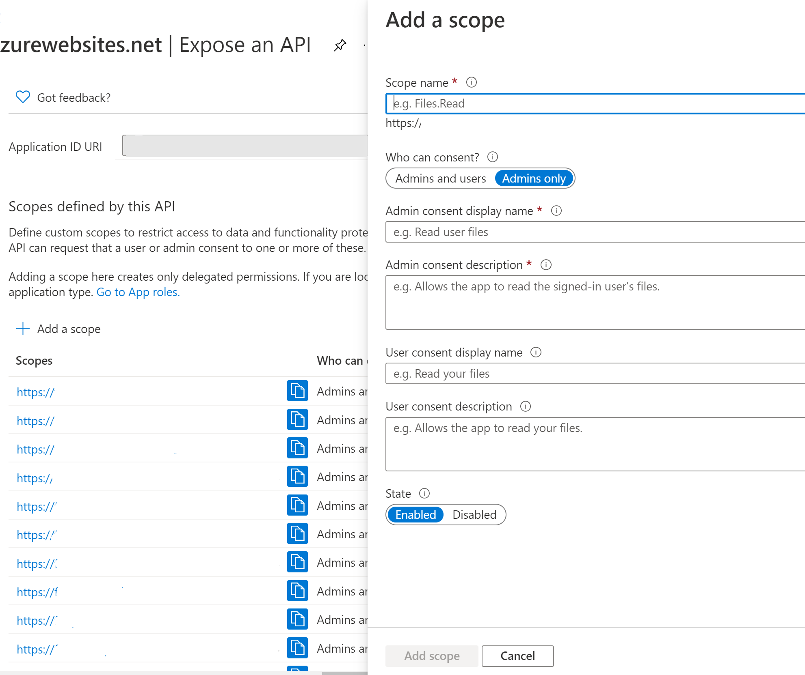
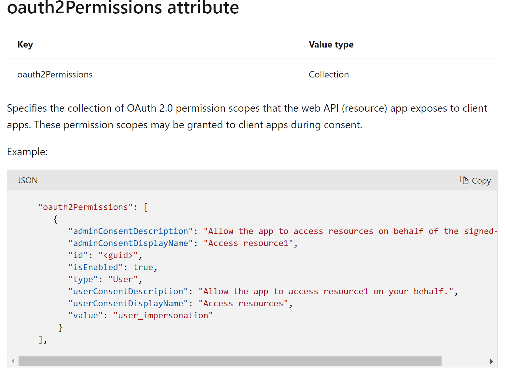

# Secure FHIR Gateway and Proxy - OAuth Scopes Guide
## Introduction
In order to support the SMART on FHIR authorization scheme the Secure FHIR Gateway and Proxy relies upon the OAuth capabilities provided by Azure Active Directory. This document describes how to configure the Secure FHIR Gateway and Proxy resource application registration to enable OAuth scopes.

## Create OAuth Scope
Log into the Azure portal <https://portal.azure.com> and search for Azure Active Directory:

 

Select App registrations

Select the App registration that corresponds to the Secure FHIR Gateway:

Select Expose an API

Select Add a ccope

Complete the required fields. Additional information about the attributes may be found [here](https://docs.microsoft.com/en-us/azure/active-directory/develop/reference-app-manifest)

Create as many scopes as required to support your SMART on FHIR application.

## Additional Information
See the Secure FHIR Gateway and Proxy configuration and operations guide for more details about SMART on FHIR support [needadocumentlinkwithdetails](https://github.com/microsoft/fhir-proxy/blob/main/docs/configuration.md)

### Azure Active Directory Links

[Application types for the Microsoft identity platform](https://docs.microsoft.com/en-us/azure/active-directory/develop/v2-app-types)

[OAuth 2.0 and OpenID Connect protocols on the Microsoft identity platform](https://docs.microsoft.com/en-us/azure/active-directory/develop/active-directory-v2-protocols)

[Quickstart: Register an application with the Microsoft identity platform](https://docs.microsoft.com/en-us/azure/active-directory/develop/quickstart-register-app)

[Permissions and consent in the Microsoft identity platform](https://docs.microsoft.com/en-us/azure/active-directory/develop/v2-permissions-and-consent)

[How to remove an application registered with the Microsoft identity platform](https://docs.microsoft.com/en-us/azure/active-directory/develop/howto-remove-app)