# Quickstart: Use an ARM template to deploy FHIR Proxy
### **Table of Contents**

1. [**Introduction**](#introduction)
2. [**General Considerations**](#general_considerations)
3. [**Prerequisites**](#prerequisites)
4. [**Deploy FHIR Proxy via ARM Template**](#deploy)
    + [**Using Azure Portal**](#azure_portal)
    + [**Using CLI**](#cli)
5. [**After the install**](#after_the_install)
6. [**Troubleshooting**](#troubleshooting)
7. [**FAQ**](#faq)

### **Introduction** <a name="introduction"></a>
In this guide, you’ll learn how to deploy [FHIR Proxy](https://github.com/microsoft/fhir-proxy) as a gateway server application in support of [Azure Healthcare APIs](https://docs.microsoft.com/en-us/azure/healthcare-apis/) [FHIR service](https://docs.microsoft.com/en-us/azure/healthcare-apis/fhir/) / [OSS FHIR Server for Azure](https://github.com/microsoft/fhir-server). For general information about FHIR Proxy, please see the [FHIR Proxy README](https://github.com/microsoft/fhir-proxy#readme).

### **General Considerations** <a name="general_considerations"></a>
+ FHIR Proxy must be installed in the same Azure Active Directory (AAD) tenant along with the FHIR server it is paired with (either Azure Healthcare APIs [FHIR service](https://docs.microsoft.com/en-us/azure/healthcare-apis/fhir/) or the [OSS FHIR Server for Azure](https://github.com/microsoft/fhir-server)).
+ For the order of installation, it is best to install the FHIR server first and then FHIR Proxy. This guide assumes that the user is deploying FHIR Proxy in an AAD tenant with an existing FHIR server installation.
+ FHIR Proxy and the FHIR server can be in the same resource group, or they can live in separate resource groups.
+ When FHIR Proxy is installed, the following **basic infrastructure components** are placed in FHIR Proxy's resource group:
    + **Application Service Plan** - The underlying compute platform for FHIR Proxy.
    + **Storage Account** - Required by the Application Service Plan for data persistence, etc.
    + **Function App** - The layer that wraps FHIR Proxy's code execution, providing an interface for messaging with other Azure resources.
    + **Key Vault** - For secure management of authentication secrets needed to access the FHIR server, Redis Cache, etc.
    + **Application Insights** - For performance metrics and issue tracing.
    + **Log Analytics Workspace** - For easier consolidation of Application Insights data.
    + **Redis Cache** - Caching to speed up data queries, etc.
+ To accommodate a range of Azure administrative privileges, FHIR Proxy deployment is divided into **three steps**:
    + **Step 1** Deploy FHIR Proxy basic infrastructure components (see above).  
    + **Step 2** Register FHIR Proxy as an application in the AAD tenant (allows FHIR Proxy to connect with the FHIR server).  
    + **Step 3** Update the Function App configuration to enable AAD Authentication (sets the authentication framework for accessing FHIR Proxy).

## **Prerequisites** <a name="prerequisites"></a>
Make sure to have the following ready before deploying FHIR Proxy.

### For **Step 1 Deployment:**
+ An Azure account with an active Subscription
+ **Contributor-level permissions in the Azure Subscription**
+ An AAD tenant connected with the Azure Subscription
+ An Azure resource group (can be created at time of install)
+ Azure Subscription ID (```subscriptionId```)
+ AAD Tenant ID (```tenantId```)
+ A FHIR server installation in the AAD tenant
+ Access to the following FHIR server parameters (*see information about where to locate each value*):
    + FHIR server URL (```fhirServerUrl```) → (*Azure Portal - FHIR server resource - Authentication - Audience*)
    + FHIR server Tenant Name (```fhirServerTenantName```) → (*Azure Portal - AAD - Properties - Name*)
    + FHIR server Client ID (```fhirServerClientId```) → (*Azure Portal - AAD - App registrations - Application (client) ID*)
    + FHIR server Secret (```fhirServerSecret```) → (*Azure Portal - AAD - App registrations - Display name - Client credentials*)
    + FHIR server Resource (```fhirServerResource```) → (*Azure Portal - FHIR server resource group - Properties - Resource ID*)


### For **Steps 2 and 3 Deployment:**
+ **Permissions to register applications in the AAD tenant**

Any of these AAD roles would have the permissions required for Steps 2 and 3:
+ Application Administrator
+ Application developer
+ Cloud administration administrator

For more information, see [Quickstart: Register an application with the Microsoft identity platform](https://docs.microsoft.com/en-us/azure/active-directory/develop/quickstart-register-app).

#
## **Deploy FHIR Proxy via Azure Resource Manager (ARM) Template** <a name="deploy"></a> <a name="azure_portal"></a>
## **Step 1 Deployment (Azure Portal)** <a name="azure_portal_step_1"></a>
##### In Step 1, you will be filling out information in an ARM template that will let you automatically deploy the basic infrastructure components for FHIR Proxy. These components are FHIR Proxy's **Application Service Plan**, **Storage Account**, **Function App**, **Key Vault**, **Application Insights**, **Log Analytics Workspace**, and **Redis Cache**.

[](https://portal.azure.com/#create/Microsoft.Template/uri/https%3A%2F%2Fraw.githubusercontent.com%2Fmicrosoft%2Ffhir-proxy%2Fmain%2Ftemplates%2Fazuredeploy.json)

### **Instructions**

1. Click on the "Deploy to Azure" link above.
2. Select (or create) a **Resource group**.  
    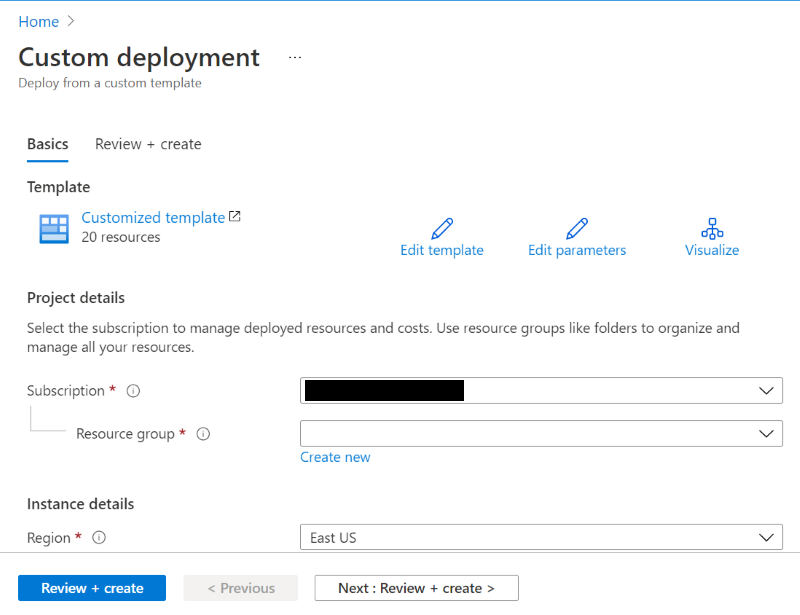
3. Scroll down and enter tag values (as needed) in the **Resource Tags** field:  

        {"costCenter": "XXXXX",
        "customerName": "XXXXX",
        "projectName": "XXXXX",
        "environment": "XXXXX",
        "fhirProxyVersion": "v1.0"}
    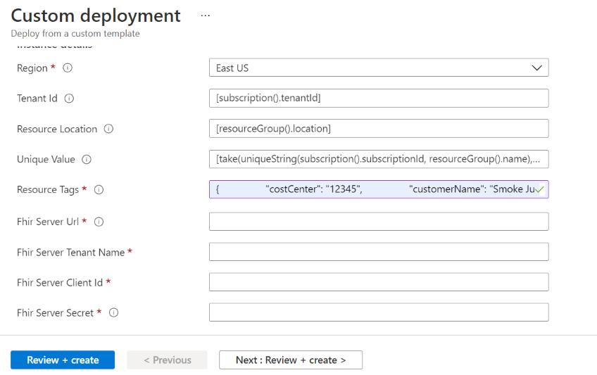

4. Fill in these FHIR server parameter values (*see information about where to locate each value*):
    + **Fhir server Url** → (*Azure Portal - FHIR server resource - Authentication - Audience*)
    + **Fhir server Tenant Name** → (*Azure Portal - AAD - Properties - Name*)
    + **Fhir server Client Id** → (*Azure Portal - AAD - App registrations - Application (client) ID*)
    + **Fhir server Secret** → (*Azure Portal - AAD - App registrations - Display name - Client credentials*)
    + **Fhir server Resource** → (*Azure Portal - FHIR server resource group - Properties - Resource ID*)

5. Scroll down and input your choice* of FHIR Proxy pre- and post-processor plugin modules in comma-separated lists:
    + **Fhir Proxy Pre Process** (```fhirProxyPreProcess```)

            FHIRProxy.preprocessors.ProfileValidationPreProcess,
            FHIRProxy.preprocessors.EverythingPatientPreProcess

    + **Fhir Proxy Post Process** (```fhirProxyPostProcess```)

            FHIRProxy.postprocessors.FHIRCDSSyncAgentPostProcess2,
            FHIRProxy.postprocessors.DateSortPostProcessor,
            FHIRProxy.postprocessors.ParticipantFilterPostProcess,
            FHIRProxy.postprocessors.PublishFHIREventPostProcess,
            FHIRProxy.postprocessors.ConsentOptOutFilter

*The ```FHIRProxy.preprocessors.TransformBundlePreProcess``` is filled in by default.

6. Leave the remaining pre-filled parameters as they are. It is also recommended to leave the remaining blank parameters unfilled – the ARM template will automatically generate values for these. Alternatively, you can assign custom values to the unfilled Name parameters (if needed).

7. Click the blue "Review + create" button.

8. You should receive a "Validation Passed" message.  

    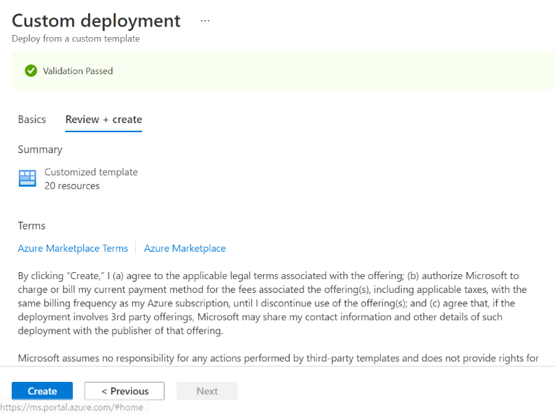

9. Click the blue "Create" button.

10. You should be taken to the Overview blade in Deployment with a "Deployment is in progress" message.
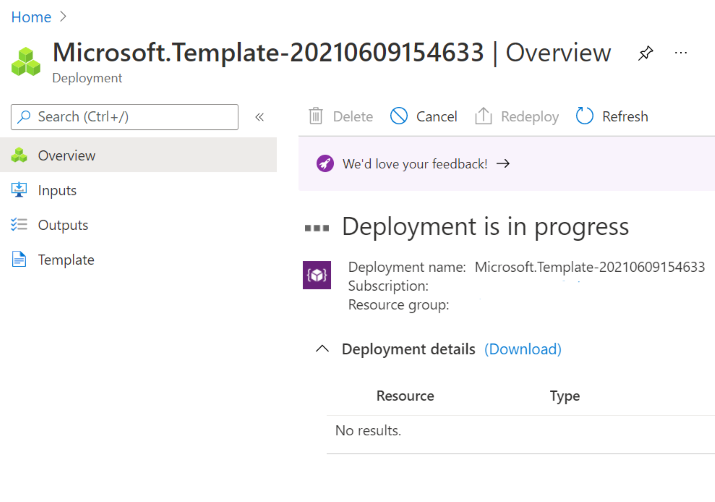

##### **FHIR Proxy deployment typically takes between 15 - 25 minutes.*

11. When **Step 1** deployment is complete, you will receive a message like shown below.  
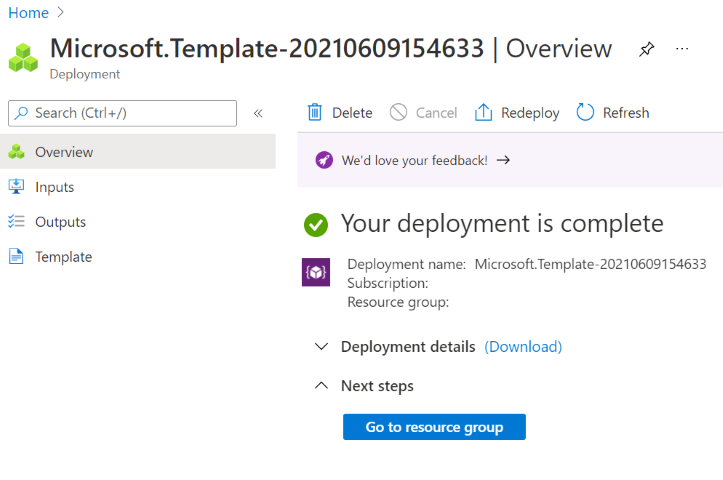

## **Step 2 Deployment (Azure Portal)** <a name="azure_portal_step_2"></a>
##### For Step 2*, you will be registering FHIR Proxy as an application in the AAD tenant and storing credentials that FHIR Proxy needs to operate with the FHIR server. General information about these topics can be found here: [Application and service principal objects in Azure Active Directory](https://docs.microsoft.com/en-us/azure/active-directory/develop/app-objects-and-service-principals).

##### *If you would prefer to perform Step 2 without having to go through the process manually, use the [CLI Step 2](#cli_step_2) deployment option instead of Azure Portal. 

### **Instructions**
12. In Azure Portal, go to *Azure Active Directory - App registrations*.

13. Click on "New registration".

14. A **Register an application** form will open.
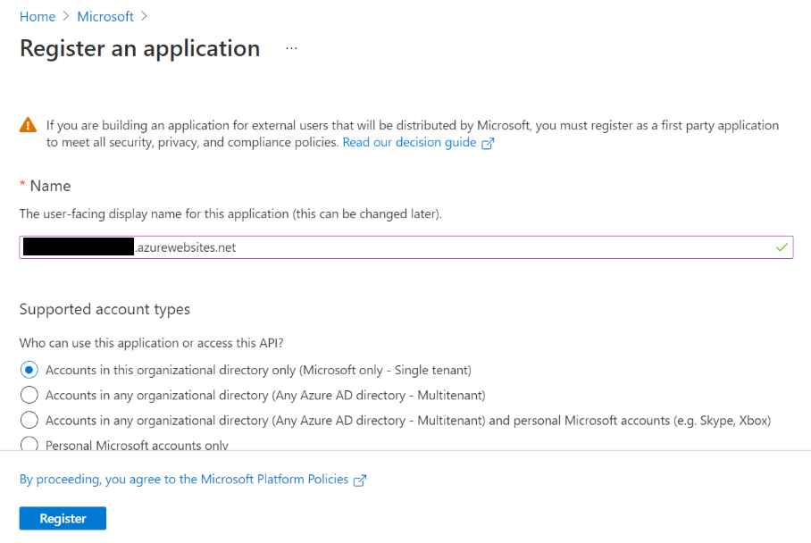

15. In the **Name** field, enter the name that you want to display in AAD for your FHIR Proxy application registration. 
    Recommended: Function App name + ".azurewebsites.net" (```<function_app_name>.azurewebsites.net```).

16. Scroll down to the **Redirect URI (optional)** field, and for **Web**, input "https://" + Function App name + "/.auth/login/aad/callback" (```https://<function_app_name>/.auth/login/aad/callback```).
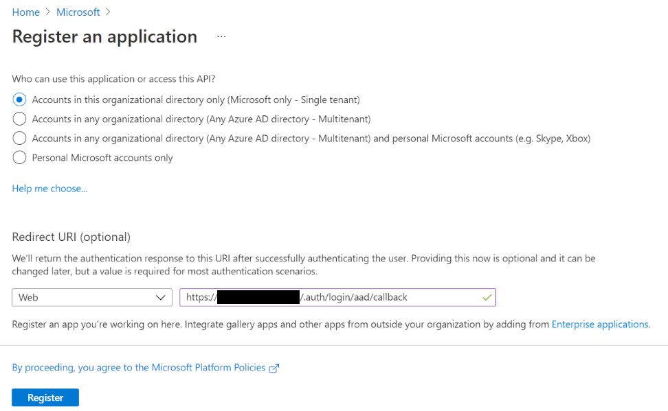

17. Click the blue "Register" button.

18. Go to *Portal - Azure Active Directory - Overview* and click on "Add an Application ID URI" under **Application ID URI**.

19. You will be taken to the *Portal - Azure Active Directory - Registered Applications - FHIR Proxy - Expose an API* blade. There you will see **Application ID URI** at the top. Click on "Set".

20. Under **Add a scope**, in the **Application ID URI** field enter "https://" + Function App name + ".azurewebsites.net" (```https://<function_app_name>.azurewebsites.net```).
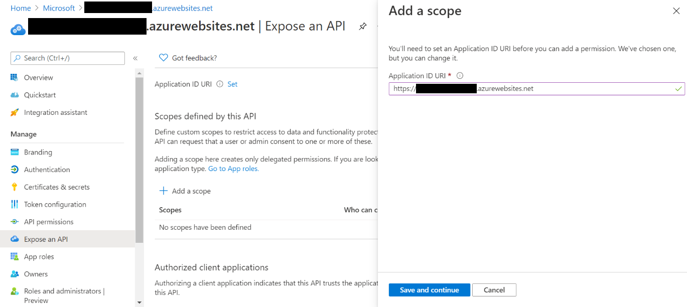

21. Click the blue "Save and continue" button. In the *Portal - Azure Active Directory - Overview* blade you should see your new URI appear under **Application ID URI**.

22. While in the *Portal - Azure Active Directory - Overview* blade, click on "Add a certificate or secret" under **Client credentials**.

23. You will be taken to the *Portal - Azure Active Directory - Registered Applications - FHIR Proxy - Certificates and secrets* blade.

24. Scroll down to **Client Secrets** and click on "New client secret".

25. Under **Add a client secret**, in the **Description** field, enter Function App name + ".azurewebsites.net" (```<function_app_name>.azurewebsites.net```).

26. In the **Expires** dropdown menu, make your selection for the client secret's lifetime before expiration.
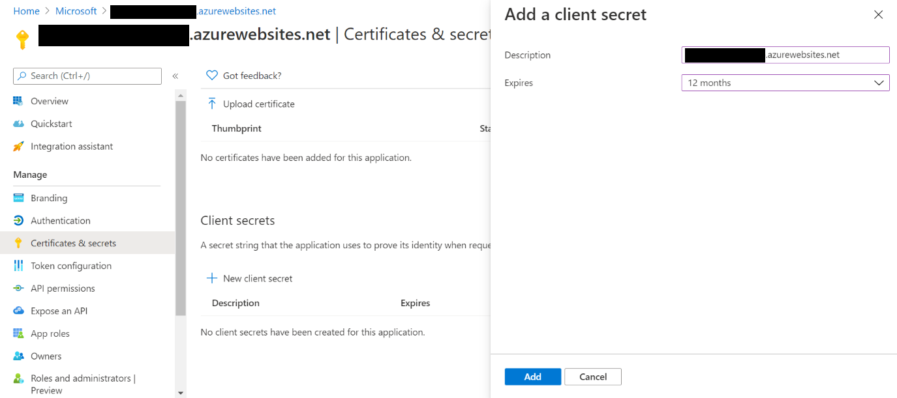

27. Click the blue "Add" button.

28. Under **Client secrets**, you will now see FHIR Proxy's client secret **Value** and **Secret ID**.
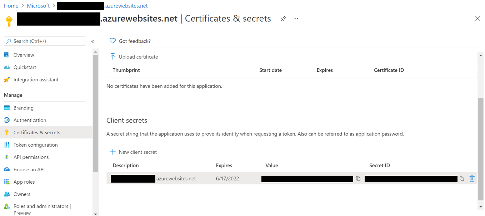

29. Make sure to copy the client secret **Value** (and **Secret ID**) strings and store them somewhere safely before leaving the page. Once you leave the page, you won't be able to access the client secret **Value** from AAD again.

30. If you go back to the *Portal - Azure Active Directory - Overview* blade, you should see "1 secret" under **Client credentials**.

31. Now go to *Portal - FHIR Proxy resource group - Key Vault - Access Policies*.

32. Next to **Permission model**, make sure "Vault access policy" is selected and then click on "Add Access Policy".

33. You will be taken to an **Add access policy** form. Add an access policy for yourself in the Key Vault so that you will be able to store (and access) FHIR Proxy credentials. See this page for more information: [Assign a Key Vault access policy using the Azure portal](https://docs.microsoft.com/en-us/azure/key-vault/general/assign-access-policy-portal).

34. Under **Principal**, search for yourself, highlight the object that appears below the search field, and then click the "Select" button.
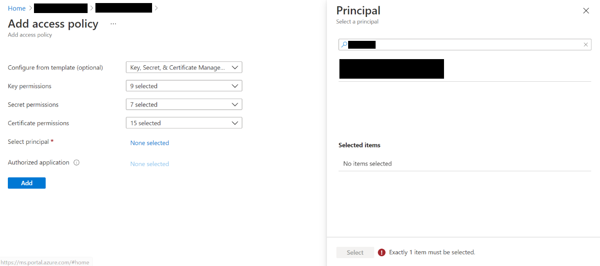

35. Now click the blue "Add" button at the bottom of the **Add access policy** form.
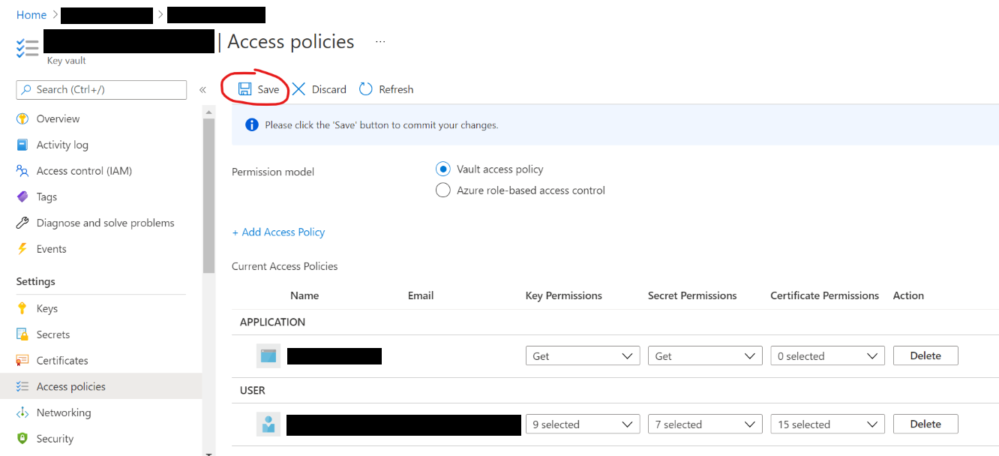

36. Once you are back in the *Portal - FHIR Proxy resource group - Key Vault - Access Policies* blade, click the "Save" button.

37. Now go to the *Portal - FHIR Proxy resource group - Key Vault - Secrets* blade.

38. You should see a list of nine items in the **Name** column.
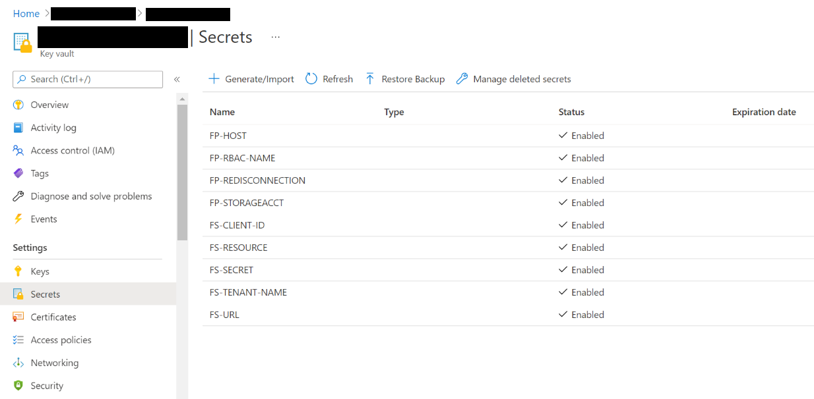

39. Click on "Generate/Import".

40. Under **Create a secret** in the **Name** field, enter "FP-RBAC-CLIENT-ID" as shown and then copy your FHIR Proxy's **Application (client) ID** from *Portal - Azure Active Directory - Overview* and paste it into the **Value** field (as shown).
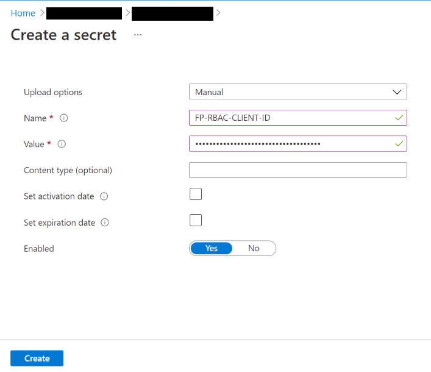

41. Click the blue "Create" button.

42. Repeat #39-41 for "FP-RBAC-TENANT-NAME" as shown below. The **Directory (tenant) ID** can be obtained from *Portal - Azure Active Directory - Overview*.
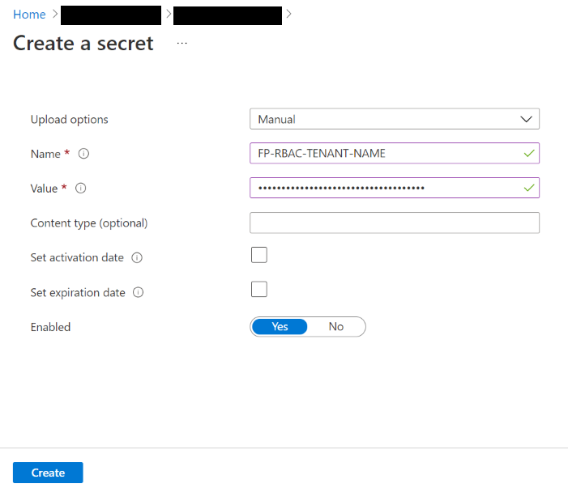

43. Lastly, repeat #39-41 for "FP-RBAC-CLIENT-SECRET" as shown below. Paste the client secret string from #28-29 into the **Value** field. Select the **Set expiration date** parameter as desired and fill in your preferred expiration date (if needed).
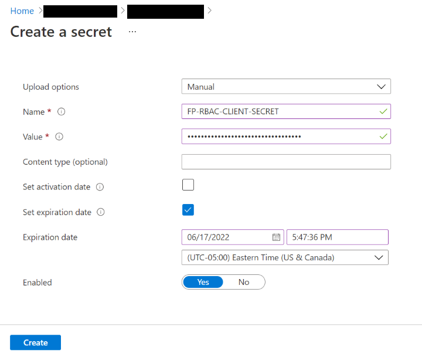


## **Step 3 Deployment (Azure Portal)** <a name="azure_portal_step_3"></a>
##### In Step 3, you will be updating the **Function App** configuration to enable an AAD authentication flow for client apps that interact with FHIR Proxy.
### **Instructions**

44. In Azure Portal, open the **Function App** in FHIR Proxy's resource group and go to the **Authentication** blade.

45. Click on the pencil icon in the **Edit** column and you will be taken to the **Add an identity provider** form shown below. 

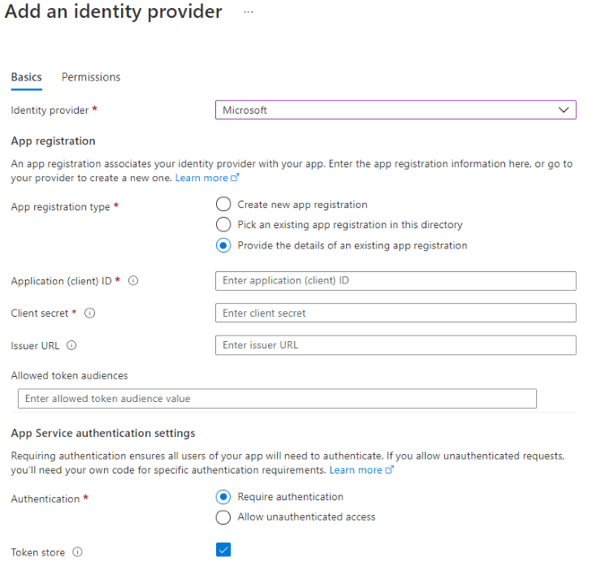

46. Populate these **App registration** fields with information obtained from **Step 2**:

+ Application (client) ID → FHIR Proxy Application ID (```$spappid```) 
+ Client secret → Application Secret (generated in **Step 2**) ```$spsecret``` 
+ Issuer URL → Token Issuer URL (```https://sts.windows.net/$tenantId```)

47. When you are done putting in the information above and you have selected your **App Service authentication settings**, click on the **Next: Permissions** button. You should receive a message as shown below.

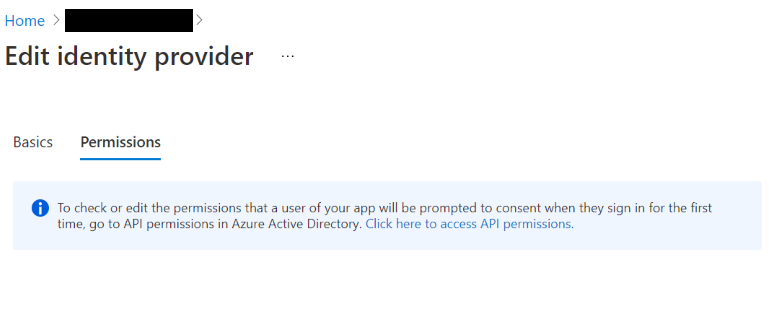

48. You are now done with your initial deployment of FHIR Proxy. Please see the [**After the install**](#after_the_install) section to confirm that the deployment was successful.

#
## **Deploy FHIR Proxy via Azure Resource Manager (ARM) Template** <a name="cli"></a>
## **Step 1 Deployment (CLI)** <a name="cli_step_1"></a>
##### In Step 1, you will be filling out information in an ARM template that will let you automatically deploy the basic infrastructure components for FHIR Proxy. These components are FHIR Proxy's Application Service Plan, Storage Account, Function App, Key Vault, Application Insights, Log Analytics Workspace, and Redis Cache.
#####   For CLI deployment, you will need access to a Bash environment set up with the following:

+ Git <https://git-scm.com/>
+ A GitHub account <https://github.com/>
+ Azure CLI <https://docs.microsoft.com/en-us/cli/azure/>

### **Instructions**

1. Open Bash locally or go to [Azure Cloud Shell](https://shell.azure.com/).

2. Make a clone of this GitHub repository:
 <https://github.com/microsoft/fhir-proxy>.

        $ git clone https://github.com/microsoft/fhir-proxy.git

3. Change the current working directory to ```./fhir-proxy/templates```.

        $ cd fhir-proxy/templates

4. Log in to your Azure account (if not already logged in).
    
        $ az login --tenant $tenantId
        $ az account set --subscription $subscriptionId

5. Create an Azure resource group (if necessary).

        $ az group create --name <resource_group_name> --location $locationName

6. Inside the ```templates``` directory, open the ```azuredeploy.parameters.json``` file in a text editor. Find the ```"resourceTags"``` parameter and fill in the values (as needed).

        {"costCenter": "XXXXX",
        "customerName": "XXXXX",
        "projectName": "XXXXX",
        "environment": "XXXXX"}

7. With the ```azuredeploy.parameters.json``` file still open, populate the ```"value": ""``` for each FHIR server parameter (please see the [**Prerequisites**](#prerequisites) section for information on where to find these parameters in Azure Portal).

        "fhirServerResource": {
            "value": ""
        },
        "fhirServerUrl": {
            "value": ""
        },
        "fhirServerTenantName": {
            "value": ""
        },
        "fhirServerClientId": {
            "value": ""
        },
        "fhirServerSecret": {
            "value": ""

8. In the ```azuredeploy.parameters.json``` file, select the values from below that you wish to include for the ```fhirProxyPreProcess``` and ```fhirProxyPostProcess``` parameters*. Once you have chosen which plugin modules to install, fill them in as comma-separated lists (as shown).

    + FHIR Proxy Pre-Process Plugin Modules (```fhirProxyPreProcess```)

            "fhirProxyPreProcess": {
            "value":"FHIRProxy.preprocessors.ProfileValidationPreProcess",
                    "FHIRProxy.preprocessors.EverythingPatientPreProcess"
                    }

    + FHIR Proxy Post-Process Plugin Modules (```fhirProxyPostProcess```)

            "fhirProxyPostProcess": {
            "value":"FHIRProxy.postprocessors.FHIRCDSSyncAgentPostProcess2",
                    "FHIRProxy.postprocessors.DateSortPostProcessor",
                    "FHIRProxy.postprocessors.ParticipantFilterPostProcess",
                    "FHIRProxy.postprocessors.PublishFHIREventPostProcess",
                    "FHIRProxy.postprocessors.ConsentOptOutFilter"
                    }

*The ```FHIRProxy.preprocessors.TransformBundlePreProcess``` is installed by default.

9. Lastly, in the ```azuredeploy.parameters.json``` file, leave all pre-filled parameters as they are. It is also recommended to leave the remaining blank parameters unfilled – the ARM template will automatically generate values for these. Alternatively, you can assign custom values to the unfilled Name parameters (if needed).  When finished, save changes made to the ```azuredeploy.parameters.json``` file. 

10. Deploy FHIR Proxy with this command.

        $ az deployment group create --name <deployment_name> --resource-group <resource_group_name> --template-file azuredeploy.bicep --parameters @azuredeploy.parameters.json

##### **FHIR Proxy deployment typically takes between 15 - 25 minutes.*

11. Once **Step 1** deployment is complete, you will receive a JSON bundle with a ```"provisioningState": "Succeeded"``` key/value pair.


## **Step 2 Deployment (CLI)** <a name="cli_step_2"></a>
##### For Step 2, you will be registering FHIR Proxy as an application in the AAD tenant and storing credentials that FHIR Proxy needs to operate with the FHIR server. General information about these topics is available here: [Application and service principal objects in Azure Active Directory](https://docs.microsoft.com/en-us/azure/active-directory/develop/app-objects-and-service-principals). 
##### Please see [Step 1 Deployment (CLI)](#cli_step_1) #1-5 for information on cloning the [fhir-proxy](https://github.com/microsoft/fhir-proxy) repository (if needed).

### **Instructions**

12. Inside the ```templates``` directory, you will see a file named ```registerproxy.bash```.

    → This is an Azure CLI-based utility that creates an application registration for FHIR Proxy in the AAD tenant.  
    → The following ```[options]``` are available:
    + ```-h``` help
    + ```-k``` to specify the name of the Key Vault that the credentials will be written to
    + ```-p``` the hostname of the FHIR Proxy instance (```<fhir_proxy_service_name>.azurewebsites.net```)

13.  Enter the following command:
<!-- -->
        $ ./registerproxy.bash -p <fhir_proxy_service_name>.azurewebsites.net -s -k <key_vault_name> 

14. When **Step 2** deployment is complete, you will receive a list in the output with the following information*:

        Application ID     = ''
        Tenant ID          = ''
        Application Secret = ''
        Token Issuer URL   = ''

*Some of this information is needed for **Step 3**. Please make a copy of the ```Application Secret``` and store it in a safe place. For your security, the ```Application Secret``` is automatically saved in the Key Vault in FHIR Proxy's resource group.

## **Step 3 Deployment (CLI)** <a name="cli_step_3"></a>
##### In Step 3, you will be updating the **Function App** configuration to enable an AAD authentication flow for client apps that interact with FHIR Proxy.
### **Instructions**

15. Enter the command below to update the Function App configuration for AAD authentication. The parameters are listed with explanations.

    ```$resourceGroupName``` → Name of resource group where FHIR Proxy is installed.  
    ```$faname``` → Name of the Function App in FHIR Proxy's resource group.  
    ```$fahost``` → Function App hostname (```$fhirProxyServiceName.azurewebsites.net```)  
    ```$spappid``` → FHIR Proxy Application ID  
    ```$spsecret``` → FHIR Proxy Application Secret (generated in **Step 2**)  
    ```$tokeniss``` → Token Issuer URL (```https://sts.windows.net/$tenantId```)

        $ az webapp auth update -g $resourceGroupName -n $faname --enabled true --action AllowAnonymous --aad-allowed-token-audiences $fahost --aad-client-id $spappid --aad-client-secret $spsecret --aad-token-issuer-url $tokeniss

16. After entering the command above you should receive a JSON bundle response with information about FHIR Proxy's authentication settings.

17. You are now done with your initial deployment of FHIR Proxy. Please see the [**After the install**](#after_the_install) section to confirm that the deployment was successful.

## After the install <a name="after_the_install"></a>

+ To verify that your FHIR Proxy deployment completed successfully, go to *Azure Portal - FHIR Proxy resource group - Key Vault - Secrets*. If the list of secrets is as shown below, then your initial FHIR Proxy deployment was successful.

    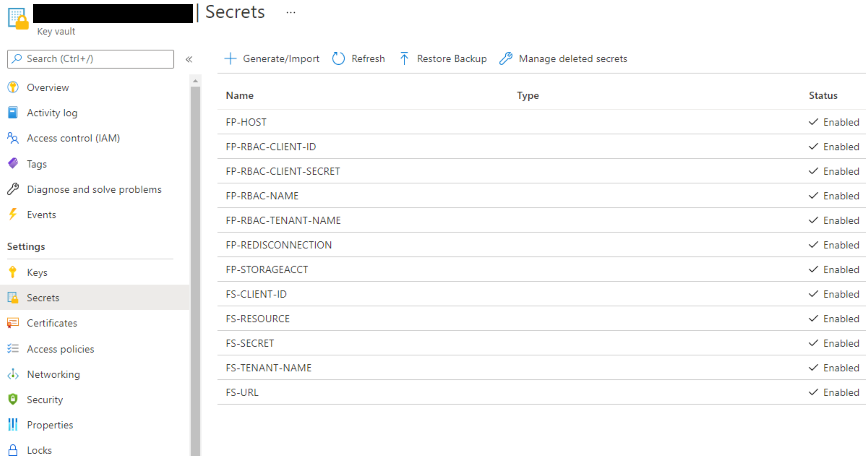

+ As mentioned in [Step 2 Deployment (Azure Portal)](#azure_portal_step_2), you can add an access policy for yourself in *Azure Portal - FHIR Proxy resource group - Key Vault* in order to access FHIR Proxy's hidden credentials – should you need to for any reason. See this page for more information: [Assign a Key Vault access policy using the Azure portal](https://docs.microsoft.com/en-us/azure/key-vault/general/assign-access-policy-portal).

+ Once you no longer need access to FHIR Proxy's credentials, it is best practice to delete your own Key Vault access policy by going to *Azure Portal - FHIR Proxy resource group - Key Vault - Access policies* and clicking on "Delete" in the **Action** column.

## Troubleshooting <a name="troubleshooting"></a>

### For Deployment using Azure Portal:
+ **Resource Tags** in **Step 1 #3** aren't passing validation in **Step 1 #8**.
    + See if there are any spaces that can be removed from the comma-separated list and try again.

+ **FHIR server Secret** parameter value needed in **Step 1 #4** is nowhere to be found.
    + It's possible that you haven't registered the FHIR server as an application in the AAD tenant yet. More information about this can be found here:  

    [Register a service client application in Azure Active Directory](https://docs.microsoft.com/en-us/azure/healthcare-apis/fhir/register-service-azure-ad-client-app)  
    [Register the Azure Active Directory apps for Azure API for FHIR](https://docs.microsoft.com/en-us/azure/healthcare-apis/fhir/fhir-app-registration?WT.mc_id=Portal-Microsoft_Healthcare_APIs)

+ **Key Vault Access Policy** is not retained after **Step 2 #35**.
    + Make sure to click "Save" in the upper left before leaving the *Portal - FHIR Proxy resource group - Key Vault - Access Policies* blade.

### For Deployment using CLI:
+ **FHIR server Secret** parameter value needed in **Step 1 #7** is nowhere to be found.
    + It's possible that you haven't registered the FHIR server as an application in the AAD tenant yet. More information about this can be found here:  

    [Register a service client application in Azure Active Directory](https://docs.microsoft.com/en-us/azure/healthcare-apis/fhir/register-service-azure-ad-client-app)  
    [Register the Azure Active Directory apps for Azure API for FHIR](https://docs.microsoft.com/en-us/azure/healthcare-apis/fhir/fhir-app-registration?WT.mc_id=Portal-Microsoft_Healthcare_APIs)

+ **An error** appears in the response after **Step 2**:  

        Adding Sign-in User Read Permission on Graph API...WARNING: Invoking "az ad app permission grant --id 69b87909-2774-47c0-9e71-eabb63617862 --api 00000002-0000-0000-c000-000000000000" is needed to make the change effective  

    + This error indicates that you don't have the admin privileges required to assign user permissions in the AAD tenant. You will still be able to deploy FHIR Proxy without these privileges, but you will need to seek a system administrator's help in configuring FHIR Proxy's role-based access control (RBAC) and SMART Scopes.

## FAQ <a name="faq"></a>

**Q:** If I don't have the permissions required for Steps 2 and 3, can I still perform Step 1 deployment with Contributor permissions and then have a system administrator complete Steps 2 and 3 at a later time?  

**A:** Yes. You can perform Step 1 as long as you have Contributor permissions in your Azure Subscription, and then someone with the required AAD permissions can handle Steps 2 and 3 whenever it is convenient.

#
**Q:** What if I don't have all of the required parameters for Step 1 readily available? Can I perform Step 1 deployment using the ARM template without those parameters?
 
**A:** Even if you are missing some required parameter values, it is still possible to carry out a Step 1 deployment for the FHIR Proxy basic infrastructure components. If you need to, you can input an arbitrary "placehoder" value (such as "...") for any required parameters that are missing and then just proceed with Step 1 as normal. Later when you gain access to the missing parameter values, you can point the ARM template at the same resource group and run the Step 1 deployment again with the parameter values filled in. Doing so will cause the ARM template to automatically update your FHIR Proxy installation without having to redeploy the basic infrastructure components.
