# **SMART on FHIR OAuth 2.0 Scope Configuration for Registered Applications**

If you have not already created a service principal for your FHIR Proxy, check out this [link](https://github.com/microsoft/fhir-proxy/blob/main/docs/QuickstartDeployARM-bicep.md) for instructions on how to do so.

In this guide you will learn how to configure scopes for your SMART on FHIR applications to utilize the OAuth 2.0 permissions exposed in your FHIR Proxy Service Principal.

Detailed information about FHIR launch contexts and scopes can be found [here](http://www.hl7.org/fhir/smart-app-launch/scopes-and-launch-context/).

Scopes are used to limit the resources a SMART on FHIR app can access within a launch context. It is best practice to grant the minimum scopes necessary for an application. A scope is made up of the context, the FHIR Resource, and the type of action that can be taken.

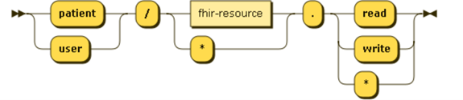

When configuring a registered application for a SMART on FHIR application follow these steps:

_These can be done through the Azure portal or through the Azure CLI. Here we will cover the Azure Portal workflow._

1. **Create a registered application in Azure AD for the SMART on FHIR application**.

  - For more information on the interaction between SMART on FHIR apps and the authentication framework for FHIR Proxy, check out this [Application Model walk through](https://docs.microsoft.com/en-us/azure/active-directory/develop/application-model).

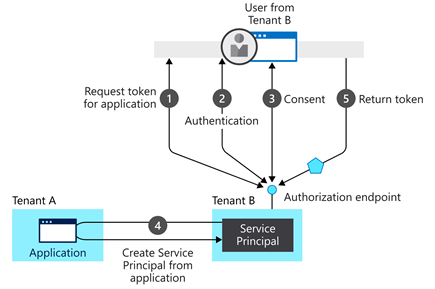

2. **Create context, resource (FHIR), and action-type specific scopes**.  
3. **Add designated scopes to the API for the SMART on FHIR registered application**.  
4. **Configure the redirect URL for the SMART on FHIR registered application**.    
  

## 1. **Create a registered application in Azure AD**.
  This tutorial provides a step by step for **creating a registered application in Azure AD**.

- [Register a service app in Azure AD - Azure API for FHIR | Microsoft Docs](https://docs.microsoft.com/en-us/azure/healthcare-apis/fhir/register-service-azure-ad-client-app)

## 2. To **create context, resource (FHIR), and action-type specific scopes**, open the Expose an API blade in the registered application.

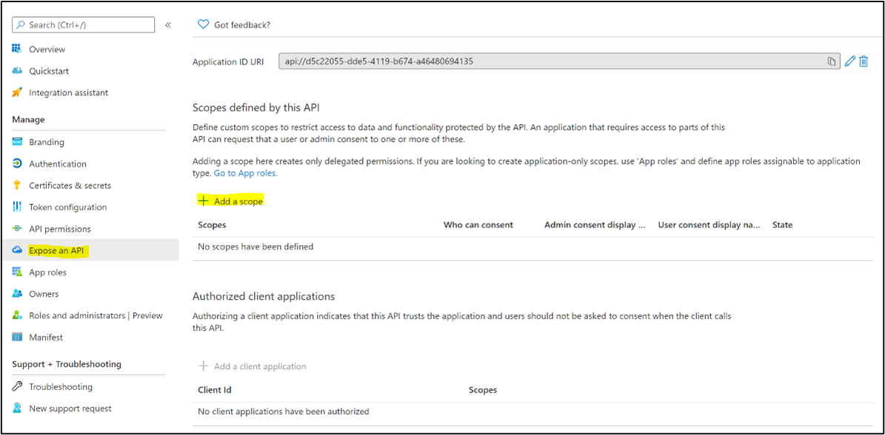

Click **+ Add Scope** and name the scope according to the context.resource.action naming convention.

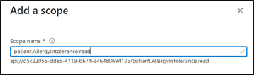

You will now have a scope defined that can be delegated to the SMART on FHIR app API.

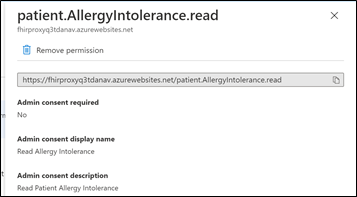

For more information on creating scopes, check out this [quickstart](https://docs.microsoft.com/en-us/azure/active-directory/develop/quickstart-configure-app-expose-web-apis#:~:text=Sign%20in%20to%20the%20Azure%20portal.%20If%20you,Select%20Expose%20an%20API%20%3E%20Add%20a%20scope.).

## 3. Determine the minimal set of scopes your SMART on FHIR application needs and **add designated scopes to the API for the SMART on FHIR registered application**.

Open the API permissions blade on the registered application and Click **+ Add a permission**. The scopes you created in step 2 should be available to add to your application.

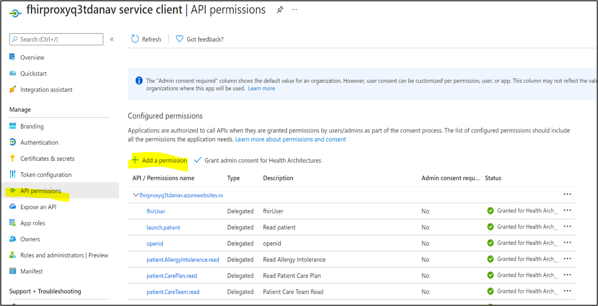

## 4. To enable the authentication flow outlined below **configure the redirect URL for the SMART on FHIR registered application**.

To do this, open the Authentication blade on the SMART on FHIR registered application. Click **+ Add a platform**, select **Web** and enter the redirect URL from your SMART on FHIR app.  

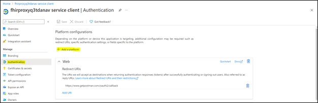

You have now configured Azure AD to facilitate the authorization workflow below for your SMART on FHIR app and the FHIR Proxy.  

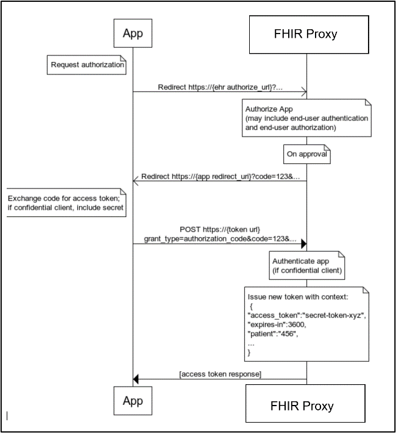

# **User to Patient Mapping to utilize the Patient Context** 

To launch an app in the patient context, an Azure AD Identifier will need to be mapped to a FHIR Patient resource Id. This can be done in multiple ways: as part of the authentication process of the SMART on FHIR app, using a third-party to authorize on the user&#39;s behalf by sending a custom claim, or by entering a mapping into the Identitylinks table in the FHIR Proxy storage account.

Mapping an Azure AD Identifier to a FHIR Patient resource Id permits the person logging in with the patient context to access data for their patient Id only.

Entering a mapping in the Identitylinks table can easily be done through the **Azure Storage Account Explorer**.

1. Connect Azure Storage Account Explorer to your Storage Account.
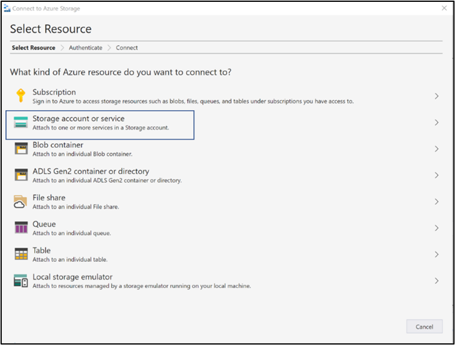 

2. Select storage account or service.

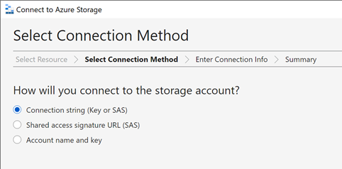

3. Select **Connection string**. You can find the Connection string on the Access keys blade for the Storage Account in the Azure Portal.

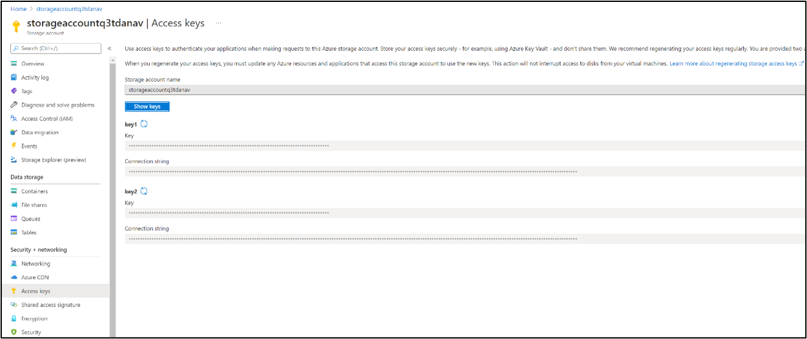

4. Once you&#39;ve connected to the storage account you can open the Identitylinks table and add an entry using the **+ Add** button.  
The **RowKey** is the Azure AD Object Id for the user logging in and the **LinkedResourceId** is the FHIR Patient Id.  

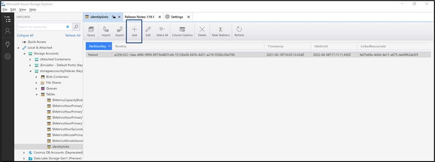

The Azure AD Object Id can be found in Azure AD -> Users -> the selected user on the Profile blade.

 
