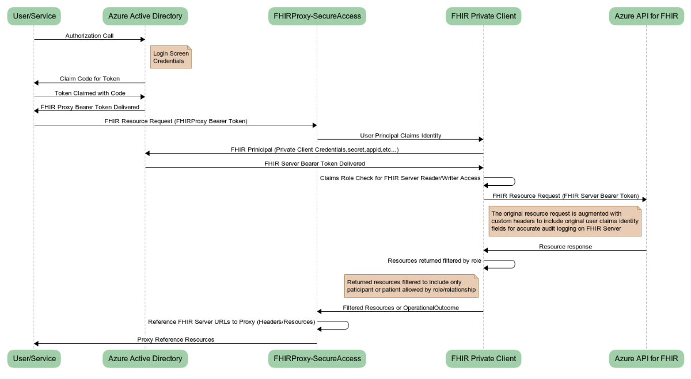

##  Configuration
The FHIR Proxy is configured on installation to be paired to a FHIR Server via a service client.  Default roles are added to the application and are configured for specific access in configuration settings section of the function app.
Enablement of pre/post processing modules is accomplished via the ```configmodules.bash``` utility.</br>

Important:  Most pre/post processing modules will require additional [configuration](https://docs.microsoft.com/en-us/azure/azure-functions/functions-how-to-use-azure-function-app-settings) after enablement, in order to function. Please check the details of the module for instructions.</br>

Notice

    THIS SOFTWARE IS PROVIDED "AS IS", WITHOUT WARRANTY OF ANY KIND, EXPRESS OR
    IMPLIED, INCLUDING BUT NOT LIMITED TO THE WARRANTIES OF MERCHANTABILITY,
    FITNESS FOR A PARTICULAR PURPOSE AND NONINFRINGEMENT. IN NO EVENT SHALL THE
    AUTHORS OR COPYRIGHT HOLDERS BE LIABLE FOR ANY CLAIM, DAMAGES OR OTHER
    LIABILITY, WHETHER IN AN ACTION OF CONTRACT, TORT OR OTHERWISE, ARISING FROM,
    OUT OF OR IN CONNECTION WITH THE SOFTWARE OR THE USE OR OTHER DEALINGS IN THE
    SOFTWARE


## Enabling Pre/Post Processing Modules
By default, no pre/post processors are configured to run.  You will need to enable and configure them following the steps below:

1. [Open Azure Cloud Shell](https://shell.azure.com) you can also access this from [azure portal](https://portal.azure.com)
2. Select Bash Shell 
3. Clone this repo (if needed) ```git clone https://github.com/microsoft/fhir-proxy```
4. Switch to the FHIR/FHIRproxy subdirectory of this repo ```cd scripts/```
5. Run the ```configmodules.bash``` script and follow the prompts to launch the selector
5. Select the option number of a module to enable it (select it again to disable)
6. To accept and configure selected processors press ENTER


Note the utility does not read current configuration it will simply enable the modules you specify and update the function configuration. To disable all modules press enter without selecting options.  To escape menu selection and abort updates press CTRL-C 

## Date Sort Post-Processor
This post process allows for date based sorting alternative on FHIR Servers that do not natively support _sort. The processor implements top level _sort=date or _sort=-date (reverse chron) query parameter for supported resource queries up to a hard maximum of 5000.</br>
The resources supported for top level_sort=date are: Observation,DiagnosticReport,Encounter,CarePlan,CareTeam,EpisodeOfCare and Claim. Any other resources will be ignored and not sorted.</br>
This processor is limited to process 5000 resource entries in a search-set bundle, it is imperative that you limit your query to not exceed this many resources for accurate results.
This processor also has the potential to cause server delays in responses for large results sets use with caution.  <I>Hints: Specify large _count parameter value to reduce calls to server and select limiting parameters for resource queries.</I>
A log warning will be issued for request that exceed the 5000 resource sort limit, but no error response will be returned just the truncated data set</br>
This process requires no additional configuration.  

## Publish Event Post-Processor
This processor will publish FHIR Server Create/Update and Delete events for affected resources to a configured eventhub.  These events can be subscribed too by any number of consumers in order to facilitate any number of orchestrated workflows. (e.g. Clinical Decision Support, Audits, Alerts, etc...)</br>
In addition to the action date the eventhub message consists of the following information:
+ Action - HTTP Verb used to modify the FHIR Server
+ Resourcetype - The type of resource affected (e.g. Patient, Observation, etc...)
+ Id - The resource logical id on the FHIR Server that was affected.
+ Version Id - The version number of the resource affected
+ LastUpdated - The date/time the affected resource was updated.

You can use the data in the eventhub message to make decisions and get affected resource information to facilitate CDS or other workflows.

This process requires two configuration settings on the function app:
```
     FP-MOD-EVENTHUB-CONNECTION: <A valid EventHub namespace connection string>
     FP-MOD-EVENTHUB-NAME: <A valid event hub in the specified event hub namespace connection>
```

## Transform Bundle Pre-Processor
This processing module will transform incoming transaction bundle requests into batch bundle request and maintain UUID associations of contained resources.  This is a alternative for updating FHIR Servers unable to handle transaction based requests.</br>
This processor will maintain internal logical id references when converted to batch mode, however, no transaction support will be included (e.g. Rollback for errors).  It will be the client responsibility to address any referential integrity or data issues that arise from server errors. Success or error status can be obtained using the batch-response bundle response.

This processor requires no additional configuration.


## Participant Filter Post-Processor
This module will filter returned resources linked to a patient to only include patients where you are the patient or are a "Practitioner of Record" (e.g. in a participant role) Note: this only filters patient based linked resources. You can use this module as a basis for building your own security filtering</br>


## How the Participant Post Processor works


## Configuring Participant Authorization Roles for Users
At a minimum users must be placed in one or more FHIR Participant roles in order to appropriately filter results from the FHIR Server. The Access roles are Patient, Practitioner and RelatedPerson. _Note:The user must also be in an appropriate Access role defined above_
1. [Login to Azure Portal](https://portal.azure.com) _Note: If you have multiple tenants make sure you switch to the directory that contains the Secure FHIR Proxy_
2. [Access the Azure Active Directory Enterprise Application Blade](https://ms.portal.azure.com/#blade/Microsoft_AAD_IAM/StartboardApplicationsMenuBlade/AllApps/menuId/)
3. Change the Application Type Drop Down to All Applications and click the Apply button
4. Enter the application id from above in the search box to locate the Secure FHIR Proxy application
5. Click on the Secure FHIR Proxy application in the list
6. Click on Users and Groups from the left hand navigation menu
7. Click on the +Add User button
8. Click on the Select Role assignment box
9. Select the access role you want to assign to specific users
   The following are the predefined FHIR Access roles:
   + Patient - This user is a patient and is linked to a Patient resource in the FHIR Server
   + Practitioner - This user is a practitioner and is linked to a Practitioner resource in the FHIR Server
   + RelatedPerson - This user is a relative/caregiver to a patient and is linked to a RelatedPerson resource in the FHIR Server
    
   When the role is selected click the select button at the bottom of the panel
10. Select the Users assignment box
11. Select and/or Search and Select registered users/guests that you want to assign the selected role too.
12. When all users desired have been selected click the select button at the bottom of the panel.
13. Click the Assign button.
14. Congratulations the select users have been assigned the participant role and can now be linked to FHIR Resources
[]()
## Linking Users in Participant Roles to FHIR Resources
1. Make sure you have configured Participant Authorization Roles for users
2. Obtain the FHIR Resource Id you wish to link to a AAD User principal.  Note you can use any search methods for the resources described in the FHIR specification.  It is strongly recommended to use a known Business Identifier in your query to ensure a specific and correct match.
   For example:
   To find a specific Patient in FHIR with a MRN of 1234567 you could issue the following URL in your browser:
   
   ```https://<your fhir proxy url>/fhir/Patient?identifier=1234567```
   
   To find a specific Practitioner with last name Smith, in this case you can use other fields to validate like address, identifiers,etc... 
   ```https://<your fhir proxy address>/fhir/Practitioner?name=smith```
    
   The resource id is located in the id field of the returned resource or resource member in a search bundle
   ```"id": "3bdaac8f-5c8e-499d-b906-aab31633337d"``` 
 
   _Note: You will need to login as a user in a FHIR Reader and/or FHIR Administrative role to view._
 
 3. You will need to obtain the participant user object id for the AAD instance in your tenant that are assigned and in roles for the secure proxy application.  Make sure the Role they are in corresponds to the FHIR Resource you are linking. 
   
 4. Now you can link the FHIR Resource to the user principal object id by entering the following URL in your browser:</br>
 
    ```https://<your fhir proxy url>/manage/link/<FHIR ResourceName>/<FHIR ResourceID>/<AD Object ID>``` 

    For example to connect Dr. Mickey in my AAD tenant principal who’s object id is 9293929-8281-dj89-a999-ppoiiwjwj to the FHIR Practitioner Resource Id 3bdaac8f-5c8e-499d-b906-aab31633337d you would enter the following URL:
    ```https://<your fhir proxy url>/manage/link/Practitioner/3bdaac8f-5c8e-499d-b906-aab31633337d/9293929-8281-dj89-a999-ppoiiwjwj```
     
    _Note: You will need to login as a user in a FHIR Administrative role to perform the assignment_

5.  Your done the principal user is now connected in role to the FHIR resource.

## Consent Opt-Out Filter

This module adds the ability to deny access to FHIR Server resources for patients who have elected to OPTOUT everyone or specific individuals and/or organizations from access to their medical data.

This module operates on the access policy that the health information of patients is accessabile automatically to authorized users, but the patient can opt out completely.

It will honor any opt-out consent record(s) effective period, deny access to everyone or specific Organizations, Practitioners, RelatedPersons and Patients (Actors)

This module will only filter if the appropriate OPT-OUT Consent Resources are stored in the FHIR Server and are in force.

For Example:
The following consent resource will not allow any individuals affiliated with the specified organization (66fa407d-d890-43a5-a6e3-eb82d3bfa393) access to any resources on the FHIR Server that are related to Patient (9ec3be2f-342c-4cb6-b2dd-c124747ef1bb) for the period 4/20/2020->12/31/2020:
```
{
    "resourceType": "Consent",
    "id": "7d044901-068e-470d-ac98-8f3889144476",
    "meta": {
        "versionId": "2",
        "lastUpdated": "2020-07-24T16:02:42.802+00:00"
    },
    "text": {
        "status": "generated",
        "div": "<div xmlns=\"http://www.w3.org/1999/xhtml\"><p>Patient wishes to withhold disclosure of all data from a timeframe to any provider.\n</p>\n</div>"
    },
    "status": "active",
    "scope": {
        "coding": [
            {
                "system": "http://terminology.hl7.org/CodeSystem/consentscope",
                "code": "patient-privacy"
            }
        ]
    },
    "category": [
        {
            "coding": [
                {
                    "system": "http://loinc.org",
                    "code": "59284-0"
                }
            ]
        }
    ],
    "patient": {
        "reference": "Patient/9ec3be2f-342c-4cb6-b2dd-c124747ef1bb"
    },
    "dateTime": "2020-05-18",
    "organization": [
        {
            "reference": "Organization/66fa407d-d890-43a5-a6e3-eb82d3bfa393"
        }
    ],
    "sourceAttachment": {
        "title": "Withhold records for time frame"
    },
    "policyRule": {
        "coding": [
            {
                "system": "http://terminology.hl7.org/CodeSystem/consentpolicycodes",
                "code": "hipaa-restrictions"
            }
        ]
    },
    "provision": {
        "type": "deny",
        "period": {
            "start": "2020-04-20T00:00:00.0000+05:00",
            "end": "2020-12-31T23:59:00.0000+05:00"
        },
        "actor": [
            {
                "role": {
                    "coding": [
                        {
                            "system": "http://terminology.hl7.org/CodeSystem/v3-ParticipationType",
                            "code": "CST"
                        }
                    ]
                },
                "reference": {
                    "reference": "Organization/66fa407d-d890-43a5-a6e3-eb82d3bfa393"
                }
            }
        ]
    }
}
```
Notes: 
+ If no Period is specified the Consent provision will be deemed in force.  If no start date is specified the default will be the earliest supported date/time.  If no end date is specified the default will be the latest supported date/time.
+ If no Actors are specified in the Consent Provision all individuals will be prevented from access
+ If the user is not linked to a FHIR resource and specific actors are specified in the opt-out consent record, the filter will be unable to determine exclusion and will be allowed access be default policy
+ Organization is determined by the linked resource association with an organization.
+ If multiple consent records are present the most restrictive policy will be used and actor filters will be aggregated.
+ This filter only covers access updates are permitted to protect recorded data.
+ This filter does not allow exceptions on specific resources all resources related to the patient are filtered
 
This process requires configuration settings on the function app:
```
    FP-MOD-CONSENT-OPTOUT-CATEGORY:<A valid CodeableConcept search string to load access consent records>
```

The recommended value for category in your consent records is LOINC code 59284-0 Consent Document the parameter value would be:
```http://loinc.org|59284-0```

It is also required that users be linked to FHIR Participant roles/resources. Please see the [Linking Users in Participant Roles to FHIR Resources]() section in the Participant Access Filter Module above.

## Everything Patient Pre Processor
This pre-preocessing module implements a limited $everything at the patient level. It returns the Patient and up to 5000 related resources for the Patient. Paging or other query parameters are not currently supported.

<I>Notes:</br> This module is provided as a building block example if used in production, returned resource limitation of 5000 should be noted to end users</br>This module should be executed after all request modifying pre-preocessors since it will call the FHIR server and stop execution of other pre-processors</I>

---

### How to file issues and get help  

This project uses GitHub Issues to track bugs and feature requests. Please search the existing 
issues before filing new issues to avoid duplicates.  For new issues, file your bug or 
feature request as a new Issue.

For help and questions about using this project, please open an [issue](https://github.com/microsoft/fhir-proxy/issues) against the Github repository. We actively triage these and will work on this as best effort.

### Microsoft Support Policy  

Support for this **PROJECT or PRODUCT** is limited to the resources listed above.