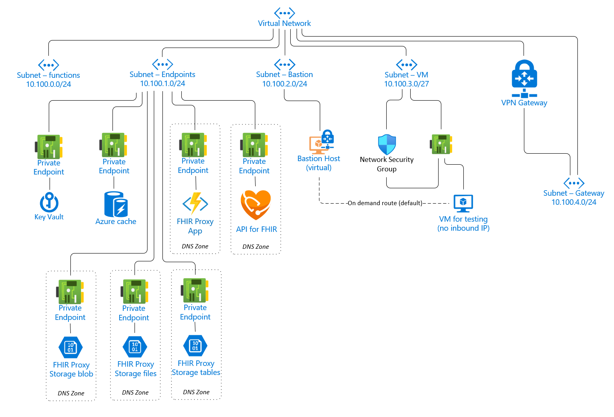

# Private Endpoint Setup 

The recommended approach to using FHIR-Proxy with Private Endpoints is to 

1) Deploy FHIR-Proxy without the Private Endpoints
2) Ensure everything is working properly
3) Switch over to the Private Endpoints 

This approach allows customers to troubleshoot potential issues as they appear. 

[Read More about Private Endpoints](https://docs.microsoft.com/en-us/azure/private-link/private-endpoint-overview)
[Read More about Functions and Private Endpoints](https://docs.microsoft.com/en-us/azure/azure-functions/functions-create-vnet)

_Sample VNet configuration with Azure API for FHIR and FHIR-Proxy_


  
## Getting Started 
In this setup, we expect that customers already have Azure API for FHIR along with FHIR-Proxy up and running. This setup will support additional components that work with VNets and VNet Peering.

**Prerequisites:**
- An Azure account with an active subscription
- An Azure Web App with a PremiumV2-tier or higher app service plan deployed in your Azure subscription.  _Note: By default, Proxy Function apps are deployed at a B1 SKU; therefore the App Service Plan must be upgraded to a Premium V2 SKU._

 

For more information and an example, see [Quickstart: Create an ASP.NET Core web app in Azure](https://docs.microsoft.com/en-us/azure/app-service/quickstart-dotnetcore).
  
For a detailed tutorial on creating a web app and an endpoint, see [Tutorial: Connect to a web app using an Azure Private Endpoint](https://docs.microsoft.com/en-us/azure/private-link/tutorial-private-endpoint-webapp-portal).


## Step 1. Creating a Virtual Network and Private Endpoint using the Azure Portal 
Get started with Azure Private Link by using a Private Endpoint to connect securely to an Azure web app. Instructions for setting up Private Endpoints are **[here](https://docs.microsoft.com/en-us/azure/private-link/create-private-endpoint-portal)**.

**a) Create a Virtual Network and Bastion Host ([link](https://docs.microsoft.com/en-us/azure/private-link/create-private-endpoint-portal#create-a-virtual-network-and-bastion-host)).**  

A private endpoint is a network interface that uses a private IP address from your virtual network. This network interface connects you privately and securely to a service powered by Azure Private Link. By enabling a private endpoint, you're bringing the service into your virtual network.    

Private Endpoint properties are defined in detail [here](https://docs.microsoft.com/en-us/azure/private-link/private-endpoint-overview#private-endpoint-properties).


**b) Create Sub-Nets within the Virtual Network (CIDR /24 preferred).**

Subnet Setup 


**c) Create a Virtual Machine for testing (see [example](https://docs.microsoft.com/en-us/azure/private-link/create-private-endpoint-portal#create-a-virtual-machine)).**

  
_Note: It is recommended that customers set up a VM with [Postman](https://www.postman.com/) on the vNet for testing. See [create a virtual machine](https://docs.microsoft.com/en-us/azure/private-link/create-private-endpoint-portal#create-a-virtual-machine)._


## Step 2.  Configure Azure API for FHIR Private Link   
Private link enables you to access Azure API for FHIR over a private endpoint, which is a network interface that connects you privately and securely using a private IP address from your virtual network. With private link, you can access our services securely from your VNet as a first party service without having to go through a public Domain Name System (DNS). This **[article](https://docs.microsoft.com/en-us/azure/healthcare-apis/azure-api-for-fhir/configure-private-link)** describes how to create, test, and manage your private endpoint for Azure API for FHIR.


At this point you should be able to test your private endpoint using either your VM with Postman - or - a PC connected to the VPN Gateway (see diagram above). Connections from the VNet should work, and connections outside the VNet should fail.

Below is an example using Postman on a VM connected via a Bastion Host. Click on these links for sample Postman [Environment](../samples/private_endpoint.postman_environment.json) and [Collection](../samples/FHIR_Commands.postman_collection.json) files. 


  
  

## Step 3.  Configure FHIR-Proxy to work with the Virtual Network and Private Links
Azure Functions offer multiple networking features with different hosting options. Azure Function networking options give customers the ability to access resources without using internet-routable addresses. Moreover, it is possible to restrict internet access to a function app - see this **[link](https://docs.microsoft.com/en-us/azure/azure-functions/functions-networking-options)** for information about these options. 

**a) Lock down your storage account** 
Create the private endpoints for Azure Files Storage, Azure Blob Storage and Azure Table Storage by using your storage account.  

__Note:  You must create all the private endpoints for your functions__

Follow the steps in this [Tutorial](https://docs.microsoft.com/en-us/azure/azure-functions/functions-create-vnet#lock-down-your-storage-account)

**b) Create a File Share**
In the Function storage account create a File Share - remember the name as it has to be placed in the Function App Config.  If you installed the FHIR-Proxy using our scripts the Connection String is already in App Config, if you are deploying manually you will need to copy it for use in the App Config.  See this [Tutorial](https://docs.microsoft.com/en-us/azure/azure-functions/functions-create-vnet#create-a-file-share)

**c) Virtual network integration**
Virtual network integration gives your app access to resources in your virtual network, but it doesn't grant inbound private access to your app from the virtual network.  Virtual network integration is used only to make outbound calls from your app into your virtual network. The VNet integration feature behaves differently when it's used with virtual networks in the same region and with virtual networks in other regions.  [Read more](https://docs.microsoft.com/en-us/azure/azure-functions/functions-networking-options#virtual-network-integration)

**[Enable VNet Integration](https://docs.microsoft.com/en-us/azure/azure-functions/functions-networking-options#enable-vnet-integration)**


   
At this point, the FHIR-Proxy acts as an application gateway, as it is the only external entry point to your Azure API for FHIR.
  
  
**d) Private Endpoint Connections**
When creating an inbound private endpoint connection for functions, you will also need a DNS record to resolve the private address. By default a private DNS record will be created for you when creating a private endpoint using the Azure portal.

To learn more, see [using Private Endpoints for Web Apps](https://docs.microsoft.com/en-us/azure/app-service/networking/private-endpoint).
  
  

**Tutorial:** Integrate Azure Functions with an Azure virtual network by using private endpoints ([link](https://docs.microsoft.com/en-us/azure/azure-functions/functions-create-vnet)).

**d-1)** Stop the FHIR Proxy App
 
**d-2)** [Create the private endpoints for Azure Files Storage](https://docs.microsoft.com/en-us/azure/azure-functions/functions-create-vnet#lock-down-your-storage-account)


_Note: The private DNS update may fail due to dynamic IP addresses on the function_ - see the sample error below.
```json
  {
    "status": "Failed",
    "error": {
        "code": "InvalidPrivateDnsZoneIds",
        "message": "Private Dns Zone group /subscriptions/###/resourceGroups/rg-fhir-dev-northcentralus-1432/providers/Microsoft.Network/privateEndpoints/pi-proxy4910-store/privateDnsZoneGroups/default has invalid private dns zone ids .",
        "details": []
    }
}
```
To correct this, customers must add the Storage Private endpoint to the Private DNS setup. 

**d-3)** Congirure Function App Settings  

https://docs.microsoft.com/en-us/azure/azure-functions/functions-create-vnet#configure-your-function-app-settings

### Private Endpoint Application Configuration settings 

[WEBSITE_CONTENTAZUREFILECONNECTIONSTRING](https://docs.microsoft.com/en-us/azure/azure-functions/functions-app-settings#website_contentazurefileconnectionstring) 
Connection string for storage account where the function app code and configuration are stored in event-driven scaling plans running on Windows. 

[WEBSITE_CONTENTSHARE](https://docs.microsoft.com/en-us/azure/azure-functions/functions-app-settings#website_contentshare)
The file path to the function app code and configuration in an event-driven scaling plan on Windows. Used with ```WEBSITE_CONTENTAZUREFILECONNECTIONSTRING```. __Use the File Share created above from step 3B__

[WEBSITE_CONTENTOVERVNET](https://docs.microsoft.com/en-us/azure/azure-functions/functions-app-settings#website_contentovervnet)
A value of ```1``` enables your function app to scale when you have your storage account restricted to a virtual network. You should enable this setting when restricting your storage account to a virtual network. To learn more, see [Restrict your storage account to a virtual network](https://docs.microsoft.com/en-us/azure/azure-functions/configure-networking-how-to#restrict-your-storage-account-to-a-virtual-network).

[WEBSITE_DNS_SERVER](https://docs.microsoft.com/en-us/azure/azure-functions/functions-app-settings#website_dns_server)
Sets the DNS server used by an app when resolving IP addresses. This setting is often required when using certain networking functionality, such as [Azure DNS private zones](https://docs.microsoft.com/en-us/azure/azure-functions/functions-networking-options#azure-dns-private-zones) and [private endpoints](https://docs.microsoft.com/en-us/azure/azure-functions/functions-networking-options#restrict-your-storage-account-to-a-virtual-network).

Leave the Setting "blank" which should pickup the default 168.x.x.x address. 

_Note:  the VNET_Route_All setting has been replaced with a switch in the VNET Configuration blade, however it can still be used in the Application Configuration_
  
[WEBSITE_VNET_ROUTE_ALL](https://docs.microsoft.com/en-us/azure/azure-functions/functions-app-settings#website_vnet_route_all)
Indicates whether all outbound traffic from the app is routed through the virtual network. A setting value of ```1``` indicates that all traffic is routed through the virtual network. You need this setting when a [virtual network NAT gateway is used to define a static outbound IP address](https://docs.microsoft.com/en-us/azure/azure-functions/functions-how-to-use-nat-gateway).

**d-4)** Start the FHIR Proxy App

If you want to make calls to Private Endpoints, then you must make sure that your DNS lookups resolve to the private endpoint. You can enforce this behavior by integrating with the Azure DNS private zone setup with Azure API for FHIR above ([link](https://docs.microsoft.com/en-us/azure/azure-functions/functions-networking-options#private-endpoints)).


 
__The Private Endpoint setup for Redis Cache and Key Vault follow the same pattern - create the private endpoint and connect to DNS.__ 

## Step 4.  Configure Redis Cache 

[Azure Document Reference](https://docs.microsoft.com/en-us/azure/azure-cache-for-redis/cache-private-link#create-a-private-endpoint-with-an-existing-azure-cache-for-redis-instance)

To create a virtual network, follow these steps.

Sign in to the Azure portal and select Create a resource.

On the New page, select Networking and then select Virtual network.

Select Add to create a virtual network.


## Step 5.  Configure Key Vault 
[Azure Document Reference](https://docs.microsoft.com/en-us/azure/key-vault/general/private-link-service?tabs=portal#establish-a-private-link-connection-to-an-existing-key-vault)

Sign in to the Azure portal.

In the search bar, type in "key vaults".

Select the Key Vault to which you want to add a private endpoint.

Select the "Networking" tab under Settings.

Select the Private endpoint connections tab at the top of the page.

Select the "+ Private Endpoint" button at the top of the page.


## Step 6.  Redeploy the Function Code
Steps are outlined [here](./updating-fhir-proxy.md)

---


## References 

Azure / GitHub Code Samples 

Connect to private endpoints with Azure Functions:
https://docs.microsoft.com/en-us/samples/azure-samples/azure-functions-private-endpoints/connect-to-private-endpoints-with-azure-functions/ 

Azure Functions, Private Endpoints, and NAT Gateway:
https://docs.microsoft.com/en-us/samples/azure-samples/non-http-trigger-azure-functions-premium-plan/non-http-trigger-azure-functions-premium-plan/ 
  

Application Configuration values loaded by this script: 

Name                                     | Value                      | Located              
-----------------------------------------|----------------------------|-------------------- 
WEBSITE_CONTENTAZUREFILECONNECTIONSTRING | Storage Connection String  | App Service Config 
WEBSITE_CONTENTSHARE                     | String value of File path  | App Service Config 
WEBSITE_CONTENTOVERVNET                  | Fixed Value of 1 or 0      | App Service Config 
WEBSITE_DNS_SERVER                       | IP Address of Private DNS  | App Service Config
WEBSITE_VNET_ROUTE_ALL                   | Fixed Value of 1 or 0      | App Service Config 


