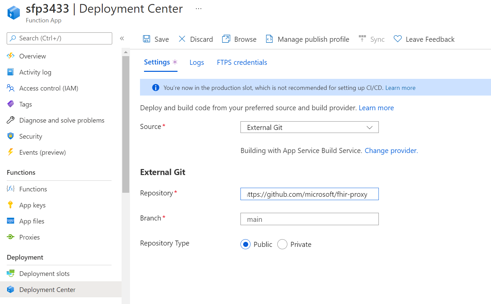

# Updating FHIR Proxy 

By default the FHIR-Proxy function stays in sync with updates posted in the Github Repo https://github.com/microsoft/fhir-proxy, as new features are added customers will automatically receive them unless they disabled deployment sync or they are operating on a closed network without external access.  

## Default FHIR Proxy Deployment 
By default FHIR Proxy 

## Editing Deployment Center setup 
If the FHIR-Proxy setup does match the default deployment, it can be changed as follows.

1. Disconnect the existing connection 

2.  Select External Git

3.  Complete the form using __https://github.com/microsoft/fhir-proxy__, __main__ and __Public__ repo then select __Save__.  

4.  Validate the deployment success via the Logs 

## Private Link FHIR Proxy Deployment
There are multiple methods to updating Azure Functions, for security reasons though a deployment process must be used.  

[Zip Deply](https://docs.microsoft.com/en-us/azure/azure-functions/functions-deployment-technologies#zip-deploy)
Zip deploy is the recommended deployment technology for Azure Functions. 

Use zip deploy to push a .zip file that contains your function app to Azure. Optionally, you can set your app to start running from package, or specify that a remote build occurs.

[Continuous Deployment](https://docs.microsoft.com/en-us/azure/azure-functions/functions-continuous-deployment)
With Private Networks, the repo source must be accessible to the private network 

---

### How to file issues and get help  

This project uses GitHub Issues to track bugs and feature requests. Please search the existing 
issues before filing new issues to avoid duplicates.  For new issues, file your bug or 
feature request as a new Issue.

For help and questions about using this project, please open an [issue](https://github.com/microsoft/fhir-proxy/issues) against the Github repository. We actively triage these and will work on this as best effort.

### Microsoft Support Policy  

Support for this **PROJECT or PRODUCT** is limited to the resources listed above.