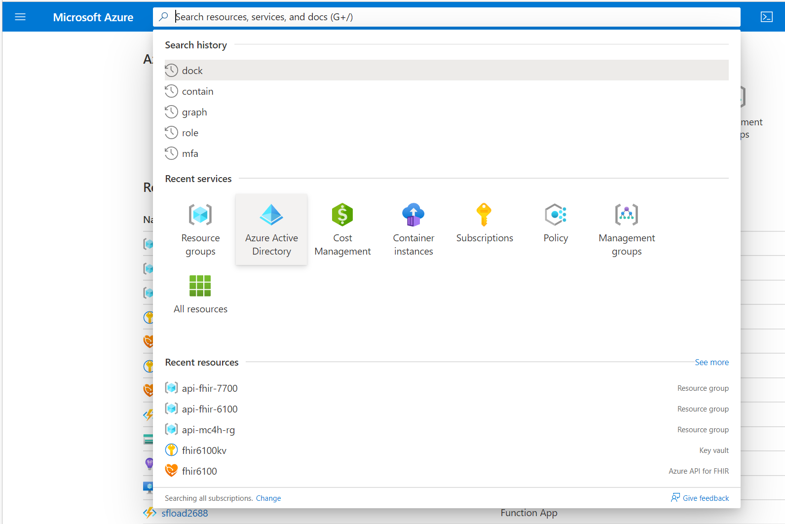
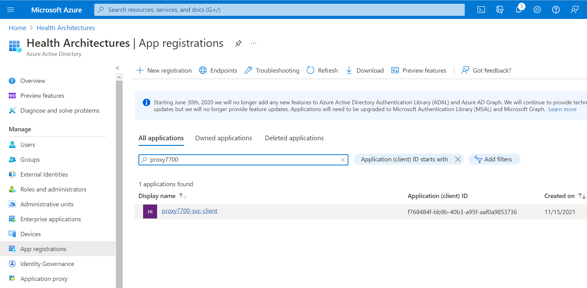
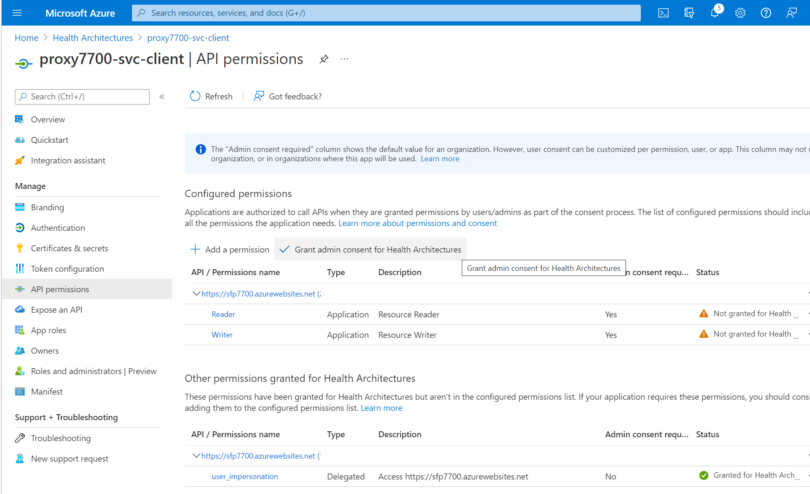
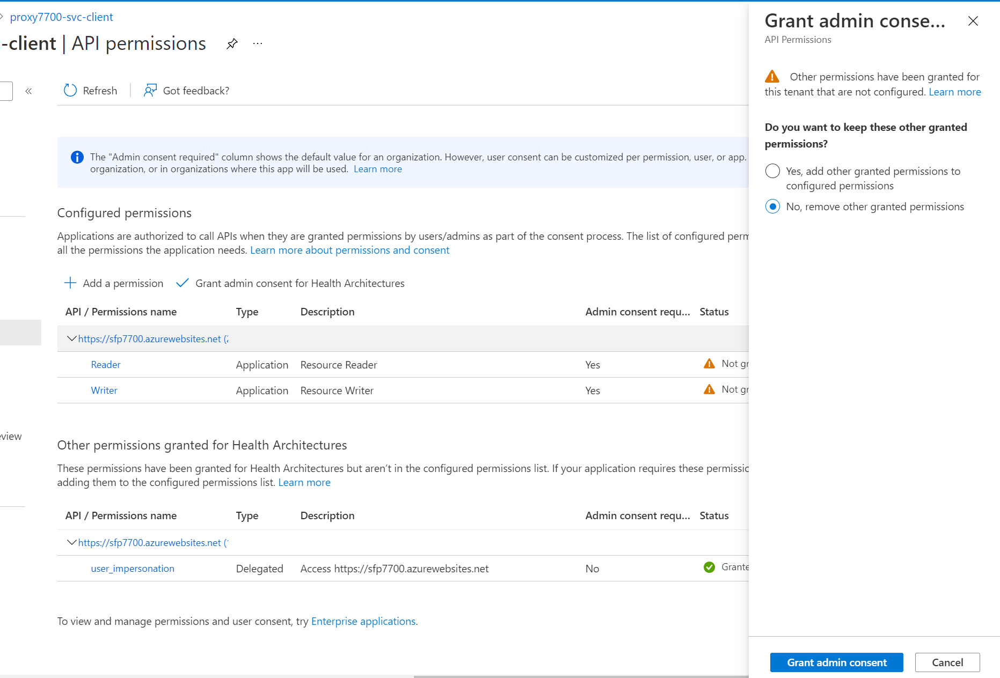
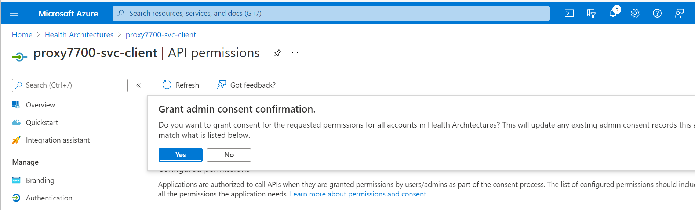
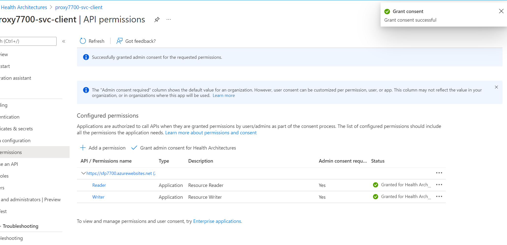
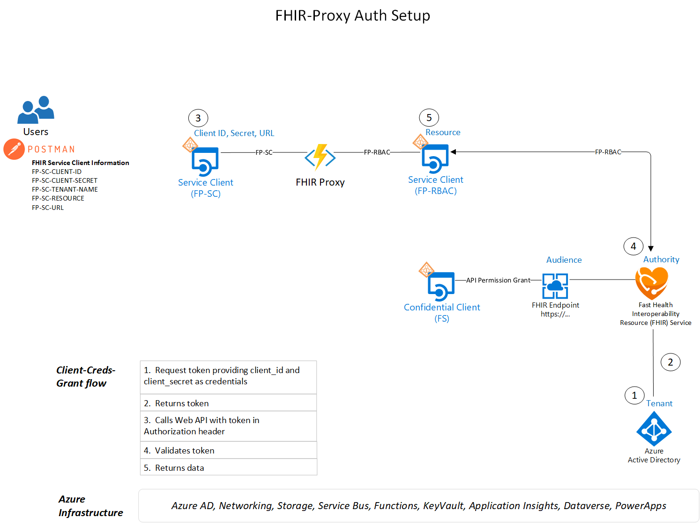

# FHIR-Proxy Getting Started with Deploy Scripts
In this document we go over the deploy scripts necessary for installing FHIR-Proxy. We cover the order of script execution and the steps needed to get up and running.

## Errata 
There are no open issues at this time. 

## Prerequisites 

These scripts will gather (and export) information necessary for the proper deployment and configuration of FHIR Proxy. In the deploy process, an Application Service Principal for RBAC will be configured. If needed, a Key Vault and Resource Group will also be deployed. All credential secrets will be stored in the Key Vault.  
 - User must have rights to deploy resources at the Subscription scope (i.e., Contributor role).
 - User must have Application Administrator rights in AAD to assign Consent at the Service Principal scope in Step 2.

__Note__
A Key Vault is necessary for securing Service Client Credentials used with the FHIR Service and FHIR-Proxy.  Only one Key Vault should be used as this script scans the Key Vault for FHIR Service and FHIR-Proxy values. If multiple Key Vaults have been deployed, please use the [backup and restore](https://docs.microsoft.com/en-us/azure/key-vault/general/backup?tabs=azure-cli) option to copy values to one Key Vault.

__Note__ 
The FHIR-Proxy scripts are designed for and tested from the Azure Cloud Shell - Bash Shell environment.

__Note__
For **Private Endpoint** setup and configuration, see [private-endpoints.md](../docs/private-endpoints.md)


### Naming & Tagging
All Azure resource types have a scope that defines the level at which resource names must be unique. Some resource names, such as PaaS services with public endpoints, have global scopes so they must be unique across the entire Azure platform. Our deployment scripts strive to suggest naming standards that group logical connections while aligning with Azure best practices. Customers are prompted to accept a default name or supply their own names during installation. See below for the FHIR-Proxy resource naming convention.

Resource Type | Deploy App Name | Number      | Resource Name Example (automatically generated)
------------|-----------------|-------------|------------------------------------------------
sfp-         | proxy           | random      | sfp-proxy12345

Resources are tagged with their deployment script and origin.  Customers are able to add Tags after installation, examples include::

Origin              |  Deployment       
--------------------|-----------------
HealthArchitectures | FHIR-Proxy   

---

## Setup 
Please note you should deploy these components into a tenant and subscriotion where you have appropriate permissions to create and manage Application Registrations (ie Application Adminitrator RBAC Role in AAD), and can deploy Resources at the Subscription Scope (Contributor role or above). 

Launch Azure Cloud Shell (Bash Environment)  
  
[](https://shell.azure.com/bash?target="_blank")

Clone the repo to your Bash Shell (CLI) environment 
```azurecli-interactive
git clone https://github.com/microsoft/fhir-proxy 
```
Change working directory to the repo Scripts directory
```azurecli-interactive
cd $HOME/fhir-proxy/scripts
```

Make the Bash Shell Scripts used for Deployment and Setup executable 
```azurecli-interactive
chmod +x *.bash 
```

## Step 1.  deployFhirproxy.bash
This is the main component deployment script for the FHIR-Proxy Azure components.    

Ensure you are in the proper directory 
```azurecli-interactive
cd $HOME/fhir-proxy/scripts
``` 

Launch the deployfhirproxy.bash shell script 
```azurecli-interactive
./deployfhirproxy.bash 
``` 

Optionally the deployment script can be used with command line options 
```azurecli
./deployfhirproxy.bash -i <subscriptionId> -g <resourceGroupName> -l <resourceGroupLocation> -k <keyVaultName> -n <deployPrefix>
```

Azure Components installed 
 - Resource Group (if needed)
 - Key Vault if needed (customers can choose to use an existing Key Vault as long as they have Purge Secrets access)
 - Azure AD Application Service Principal for RBAC 
 - Function App (FHIR-Proxy) with App Insights and Storage 
 - Function App Service Plan 

Information needed by this script 
 - FHIR Service Name
 - Key Vault Name 
 - Resource Group Location 
 - Resource Group Name 

Application Configuration values loaded by this script 

Name                               | Value                      | Located              
-----------------------------------|----------------------------|--------------------
APPINSIGHTS_INSTRUMENTATIONKEY     | GUID                       | App Service Config  
APPINSIGHTS_CONNECTION_STRING      | InstrumentationKey         | App Service Config 
AzureWebJobsStorage                | Endpoint                   | App Service Config 
FUNCTIONS_EXTENSION_VERSION        | Function Version           | App Service Config 
FUNCTIONS_WORKER_RUNTIME           | Function runtime           | App Service Config
FP-REDISCONNECTION                 | RedisCache connection      | App Service Config
FP-RBAC-CLIENT-ID                  | Client ID                  | Keyvault reference 
FP-RBAC-CLIENT-SECRET              | Client Secret              | Keyvault reference  
FP-RBAC-NAME                       | Client Name                | Keyvault reference 
FP-RBAC-TENANT-NAME                | Tenant ID / Name           | Keyvault reference 
FP-ADMIN-ROLE                      | Proxy Role Name            | App Service Config
FP-PARTICIPANT-ACCESS              | Proxy Role Name            | App Service Config
FP-READER-ROLE                     | Proxy Role Name            | App Service Config
FP-WRITER-ROLE                     | Proxy Role Name            | App Service Config
FP-GLOBAL-ACCESS-ROLES             | Proxy Role Name            | App Service Config
FP-PATIENT-ACCESS-ROLES            | Proxy Role Name            | App Service Config
FP-PARTICIPANT-ACCESS-ROLES        | Proxy Role Name            | App Service Config
FP-STORAGEACCT                     | Storage account connection | App Service Config
FS-TENANT-NAME                     | FHIR Tenant ID / Name      | App Service Config
FS-CLIENT-ID                       | FHIR Client ID             | Keyvault reference  
FS-CLIENT-SECRET                   | FHIR Client Secret         | Keyvault reference  
FS-RESOURCE                        | FHIR Resource              | Keyvault reference   


## Step 2.  createProxyServiceClient.bash
Please review the Setup steps above and make sure that you are in the Azure Cloud Shell (Bash Environment) from Step 1. 

Ensure that you are in the proper directory 
```azurecli-interactive
cd $HOME/fhir-proxy/scripts
``` 

Launch the createproxyserviceclient.bash shell script 
```azurecli-interactive
./createproxyserviceclient.bash 
``` 

Optionally the createproxyserviceclient script can be used with command line options 
```azurecli
./createproxyserviceclient.bash -k <keyVaultName> -n <serviceClient name>
```

Keyvault values loaded by this script 

Name                               | Value                      | Located              
-----------------------------------|----------------------------|--------------------
FP-SC-TENANT-NAME                  | GUID                       | Keyvault reference  
FP-SC-CLIENT-ID                    | Proxy Service Client ID    | Keyvault reference 
FP-SC-SECRET                       | Proxy Service Secret       | Keyvault reference 
FP-SC-RESOURCE                     | FHIR Resource ID           | Keyvault reference 
FP-SC-URL                          | Proxy URL                  | Keyvault reference 


## Step 3.  Grant Admin Access (Portal)
We purposely do not grant admin access in the createproxyservicevclient.bash script as not everyone has Application Administrator rights. We will supply an "admin script" for this in the next release. In the meantime, here are the Azure Portal steps necessary to grant admin access. 

Log into the Azure Portal, and go to Azure Active Directory 



Go to App Registrations and find the client created with the createProxyServiceClient.bash script 



Select API Permissions on the left blade, then slect Grant admin consent for "your tenant name"



Grant Admin Consent 





Complete 



---

# References 
FHIR-Proxy serves as a middle tier application / access and authorization endpoint. To better understand the difference in these approaches users should review 

- Client Credentials, or Implicit Oauth 2.0 flow with access token
- OAuth 2.0 Authorization code flow with access token

To request an access token, users make an HTTP POST to the tenant-specific Microsoft identity platform token endpoint with the following parameters:

```azurecli
https://login.microsoftonline.com/<tenant>/oauth2/v2.0/token
```
Overview of Proxy Auth 


Note:  When using FHIR-Proxy, refrain from using the FS- Client Credentials

To read more about the Auth flow, refer to this Microsoft Document [doc](https://docs.microsoft.com/en-us/azure/active-directory/develop/v2-oauth2-client-creds-grant-flow)


