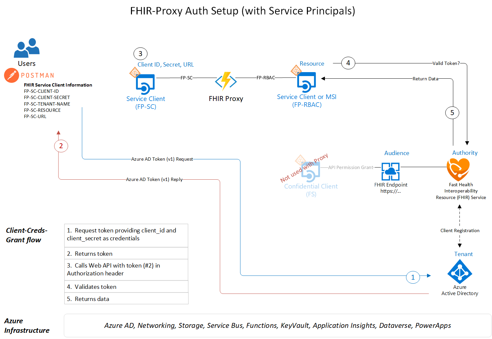

# FHIR-Proxy Getting Started with Deploy Scripts
In this document we go over the deploy scripts necessary for installing FHIR-Proxy. We cover the order of script execution and the steps needed to get up and running.

## Errata 
There are no open issues at this time. 

## Prerequisites 
You must have installed either Azure API for FHIR or Azure Health Data Services - FHIR Service

You must choose an Identity Provider to authenticate and authorize user access. You may use Azure Active Directory or any other OpenId Connect compliant provider (including Azure B2C) provided the identity provider supports the ability to define and consent to necessary scopes, roles and generate required claims in OAuth JWT id and access tokens. See [OpenId Connect Providers](/docs/oidcconfig.md) configuration document for details.


The deployment scripts will gather (and export) information necessary for the proper deployment and configuration of FHIR Proxy. In the deploy process, an Application Service Principal for RBAC will be configured. If needed, a Key Vault and Resource Group will also be deployed. All credential secrets will be stored in the Key Vault.  
 - User must have rights to deploy resources at the Subscription scope (i.e., Contributor role).
 - If using AAD as the IDP, the User must have Application Administrator rights in AAD to assign Consent at the Service Principal scope in Step 2.

__Note__
A Key Vault is necessary for securing Service Client Credentials used with the FHIR Service and FHIR-Proxy.  Only one Key Vault should be used as this script scans the Key Vault for FHIR Service and FHIR-Proxy values. If multiple Key Vaults have been deployed, please use the [backup and restore](https://docs.microsoft.com/en-us/azure/key-vault/general/backup?tabs=azure-cli) option to copy values to one Key Vault.

__Note__ 
The FHIR-Proxy scripts are designed for and tested from the Azure Cloud Shell - Bash Shell environment.


### Naming & Tagging
All Azure resource types have a scope that defines the level at which resource names must be unique. Some resource names, such as PaaS services with public endpoints, have global scopes so they must be unique across the entire Azure platform. Our deployment scripts strive to suggest naming standards that group logical connections while aligning with Azure best practices. Customers are prompted to accept a default name or supply their own names during installation. See below for the FHIR-Proxy resource naming convention.

Resource Type | Deploy App Name | Number      | Resource Name Example (automatically generated)
------------|-----------------|-------------|------------------------------------------------
sfp-         | proxy           | random      | sfp-proxy12345

Resources are tagged with their deployment script and origin.  Customers are able to add Tags after installation, examples include::

Origin              |  Deployment       
--------------------|-----------------
HealthArchitectures | FHIR-Proxy   

---

## Setup 
Please note you should deploy these components into a tenant and subscriotion where you have appropriate permissions to create and manage Application Registrations (ie Application Adminitrator RBAC Role in AAD), and can deploy Resources at the Subscription Scope (Contributor role or above). 

Launch Azure Cloud Shell (Bash Environment)  
  
[](https://shell.azure.com/bash?target="_blank")

Clone the repo to your Bash Shell (CLI) environment 
```azurecli-interactive
git clone --branch v2.0 https://github.com/microsoft/fhir-proxy
```
Change working directory to the repo Scripts directory
```azurecli-interactive
cd $HOME/fhir-proxy/scripts
```

Make the Bash Shell Scripts used for Deployment and Setup executable 
```azurecli-interactive
chmod +x *.bash 
```

## Step 1.  Deploy the FHIR Proxy Components
There are two main component deployment scripts for the FHIR-Proxy.  These scripts will deploy necessary Azure components and configure them for use. 

If you will be using Azure Active Directory as your identity provider you should use the ```deployfhirproxy.bash``` script.

If you will be using another Open Id Connect compliant identity provider or Azure B2C use the ```deployfhirproxyoidc.bash``` sciript.    

Ensure you are in the proper directory 
```azurecli-interactive
cd $HOME/fhir-proxy/scripts
``` 

Launch the correct script for your IDP
```azurecli-interactive
# Using AAD
./deployfhirproxy.bash 
```
or

```azurecli-interactive
# Using another Open Id Compliant Provider or Azure B2C
./deployfhirproxyoidc.bash 
``` 

Optionally the deployment script can be used with command line options 
```azurecli
./deployfhirproxy[oidc].bash -i <subscriptionId> -g <resourceGroupName> -l <resourceGroupLocation> -k <keyVaultName> -n <deployPrefix>
```

Azure Components installed 
 - Resource Group (if needed)
 - Key Vault if needed (customers can choose to use an existing Key Vault as long as they have Purge Secrets access)
 - Azure AD Application Service Principal for RBAC 
 - Function App (FHIR-Proxy) with App Insights and Storage 
 - Function App Service Plan 

Information needed by this script 
 - FHIR Service Name
 - Key Vault Name 
 - Resource Group Location 
 - Resource Group Name 

Application Configuration values loaded by this script 

Name                               | Value                      | Located              
-----------------------------------|----------------------------|--------------------
APPINSIGHTS_INSTRUMENTATIONKEY     | GUID                       | App Service Config  
APPINSIGHTS_CONNECTION_STRING      | InstrumentationKey         | App Service Config 
AzureWebJobsStorage                | Endpoint                   | App Service Config 
FUNCTIONS_EXTENSION_VERSION        | Function Version           | App Service Config 
FUNCTIONS_WORKER_RUNTIME           | Function runtime           | App Service Config
FP-REDISCONNECTION                 | RedisCache connection      | App Service Config
FP-RBAC-CLIENT-ID                  | Client ID                  | Keyvault reference 
FP-RBAC-CLIENT-SECRET              | Client Secret              | Keyvault reference  
FP-RBAC-NAME                       | Client Name                | Keyvault reference 
FP-RBAC-TENANT-NAME                | Tenant ID / Name           | Keyvault reference 
FP-ADMIN-ROLE                      | Proxy Role Name            | App Service Config
FP-PARTICIPANT-ACCESS              | Proxy Role Name            | App Service Config
FP-READER-ROLE                     | Proxy Role Name            | App Service Config
FP-WRITER-ROLE                     | Proxy Role Name            | App Service Config
FP-GLOBAL-ACCESS-ROLES             | Proxy Role Name            | App Service Config
FP-PATIENT-ACCESS-ROLES            | Proxy Role Name            | App Service Config
FP-PARTICIPANT-ACCESS-ROLES        | Proxy Role Name            | App Service Config
FP-STORAGEACCT                     | Storage account connection | App Service Config
FS-TENANT-NAME                     | FHIR Tenant ID / Name      | App Service Config
FS-CLIENT-ID                       | FHIR Client ID             | Keyvault reference  
FS-CLIENT-SECRET                   | FHIR Client Secret         | Keyvault reference  
FS-RESOURCE                        | FHIR Resource              | Keyvault reference
FP-OIDC-ISAAD                      | OIDC IDP is Azure AD       | App Service Config  
FP-OIDC-ISSUER                     | OIDC Issuer URL            | App Service Config
FP-OIDC-TOKEN-IDENTITY-CLAIM       | OIDC Claim Name for UserID | App Service Config
FP-OIDC-VALID-AUDIENCES            | OIDC Token Valid Audiences | App Service Config
FP-OIDC-VALID-ISSUERS              | OIDC Token Valid Issuers   | App Service Config
FP-OIDC-CUSTOM-PARMS               | OIDC Custom Parms for Auth | App Service Config

If you are using a non Azure AD identity provider or Azure B2C, STOP and please see additional configuration instructions for [OpenId Connect Providers](/docs/oidcconfig.md). 

If you are using Azure AD as the identity provider follow steps 2-5

## Step 2.  createProxyServiceClient.bash
This script is used to generate application service clients that can be used to authenticate to the fhir-proxy using the unattended client_credentials OAuth2.0 token aquisition flow. This access token is used in requests to the fhir-proxy for secure access.

Please review the Setup steps above and make sure that you are in the Azure Cloud Shell (Bash Environment) from Step 1. 

Ensure that you are in the proper directory 
```azurecli-interactive
cd $HOME/fhir-proxy/scripts
``` 

Launch the createproxyserviceclient.bash shell script 
```azurecli-interactive
./createproxyserviceclient.bash 
``` 

Optionally the createproxyserviceclient script can be used with command line options 
```azurecli
./createproxyserviceclient.bash -k <keyVaultName> -n <serviceClient name>
```

Keyvault values loaded by this script 

Name                               | Value                      | Located              
-----------------------------------|----------------------------|--------------------
FP-SC-TENANT-NAME                  | GUID                       | Keyvault reference  
FP-SC-CLIENT-ID                    | Proxy Service Client ID    | Keyvault reference 
FP-SC-SECRET                       | Proxy Service Secret       | Keyvault reference 
FP-SC-RESOURCE                     | FHIR Resource ID           | Keyvault reference 
FP-SC-URL                          | Proxy URL                  | Keyvault reference 


## Step 3.  Grant Admin Access (Service Clients Only)
We purposely do not grant admin access in the createproxyservicevclient.bash script as not everyone has Application Administrator rights.
### Generated Consent URL
In the output of your ```.deployfhirproxy.bash``` script a URL is created that when followed by the AAD Tenant Administrator will allow them to Grant Admin Consent for the registered service client application. It will look something like this:
```
 https://login.microsoftonline.com/<tenant id>/adminconsent?client_id=<client id>
```
If you are an Application Administrator for the AAD tenant you can simply follow the generate URL to grant admin consent.  If you are not, you can forward the URL to your AAD Tenant Administrator and ask that they follow the link to grant admin consent for your service client.

### Azure Portal
If your prefer the Application Administrator can use the Azure portal as well to grant consent using the following directions:


Go to App Registrations and find the client created with the createProxyServiceClient.bash script 


Select API Permissions on the left blade, then slect Grant admin consent for "your tenant name"


Grant Admin Consent 


Complete 


## Step 4. Prepare AAD Tenant for SMART Launch (For SMART Application Access Only)
In order to support the SMART FHIR Launch specification it is required to add a ```fhirUser``` claim to the id_token returned to SMART Applications from authentication flows. This is accomplished in Azure Active Directory by registering a custom claim policy, assigning SMART Applications to that policy and mapping users to associated FHIR Resources.</br> To create a fhirUser custom cliam policy follow the documentation in the [Configure fhirUser Custom Claim Policy](../docs/addingfhiridcustomclaim.md).  You will also need to map AAD Users using the instructions in the [Associate AAD User with FHIR Server Resource Reference](../docs/addingfhiridcustomclaim.md) section. You will need to specify the -a switch on the ```createproxytsmartclient.bash``` script or follow instructions in the [Add the fhirUser custom claim policy to your registered SMART Application Principal](../docs/addingfhiridcustomclaim.md) section for each SMART Application registration. 
## Step 5. createProxySmartClient.bash (For SMART Application Access Only)
This script is used to generate SMART Service Clients that can be used to authenticate to the fhir-proxy using the interactive OAuth2.0 authorization code flow. This is used for user authentication and consent to access the fhir-proxy bound by defined SMART scopes.

Please review the Setup steps above and make sure that you are in the Azure Cloud Shell (Bash Environment) from Step 1. 

You will need the following information about the SMART Client:
1. Valid Reply URL(s) for the SMART application
2. The SMART Scopes needed for the SMART application to function (e.g. fhirUser launch/patient patient/Patient.read patient/Observation.read)
3. If the SMART Application requires public or private access
Ensure that you are in the proper directory 
```azurecli-interactive
cd $HOME/fhir-proxy/scripts
``` 

Launch the createproxysmartclient.bash shell script 
```azurecli-interactive
./createproxysmartclient.bash 
``` 

It is recommended to use the createproxysmartclient script with command line options 
```azurecli
./createproxysmartclient.bash -k <keyvault> -n <smart client name> -a (If you are a tenant admin, add FHIRUserClaim to smartapp id token to support Launch context, must have FHIRUserClaim custom claim policy defined for the tenant) -p (to generate postman environment) -u (For Public Client Registration)
```
For example: Let's say you have a SMART Application to register called patientbrowser that allows a patient to view their medical record, with the following details:</br>
The application reply URL is: ```https://somepatientbrowser.com/auth/callback```.</br>
The application requires the following scopes: ``` fhirUser launch/patient patient/Patient.read patient/Condition.read patient/Observation.read```</br>
The application requires public access.</br>
The keyvault created from the fhir-proxy deployment is called ```proxykv123```</br>
You are an application administrator and want to register this application with the fhirUser claim custom policy.</br>

You would launch the createproxysmartclient.bash script from the command shell using the following:</br>
```./createproxysmartclient.bash -k proxykv123 -n patientbrowser -a -u -p```</br>

# 

# References 
FHIR-Proxy serves as a middle tier application / access and authorization endpoint. To better understand the difference in these approaches users should review 

- Client Credentials, or Implicit Oauth 2.0 flow with access token
- OAuth 2.0 Authorization code flow with access token

Overview of Proxy Auth 


Note:  When using FHIR-Proxy, refrain from using the FS- Client Credentials

To read more about the Auth flow, refer to this Microsoft Document [doc](https://docs.microsoft.com/en-us/azure/active-directory/develop/v2-oauth2-client-creds-grant-flow)


