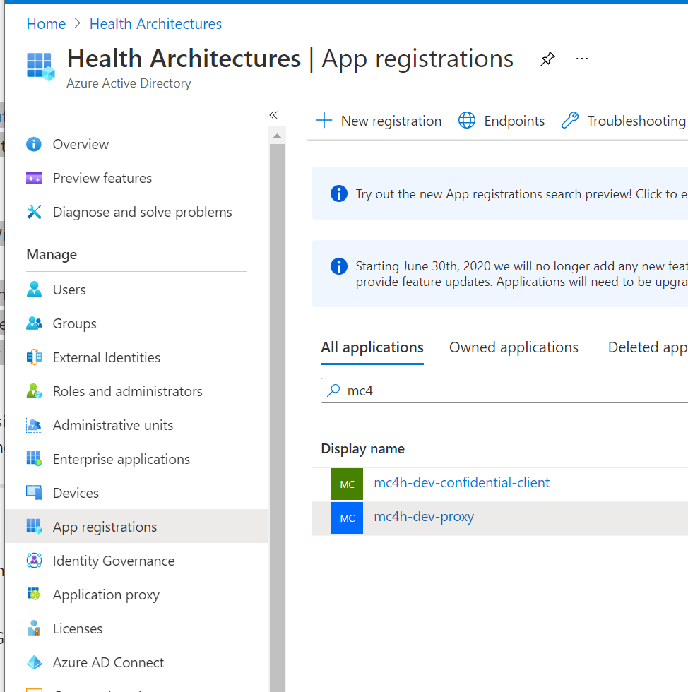
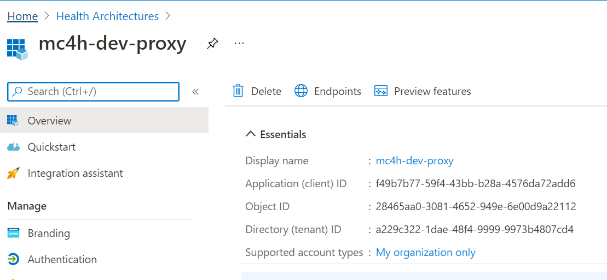
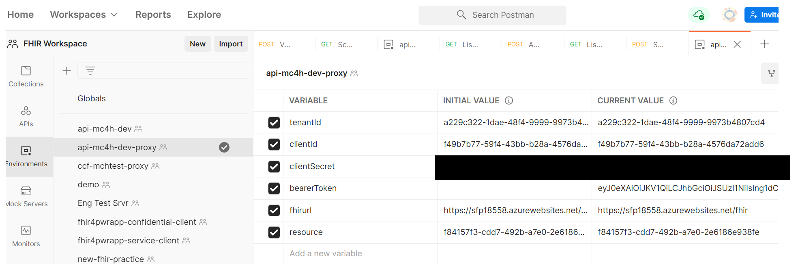
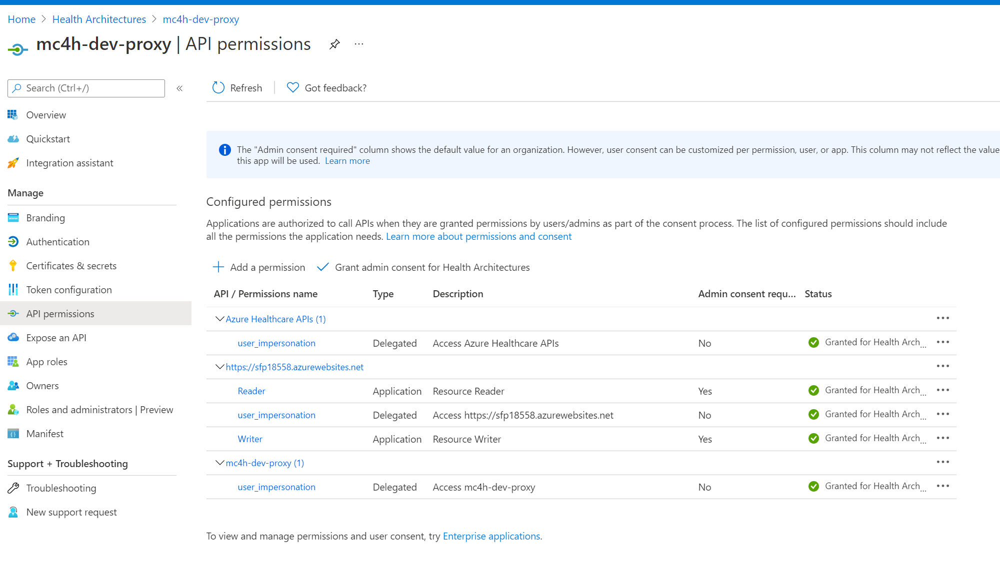

# FHIR-Proxy Getting Started Readme.md

Script purpose, order of execution and other steps necessary to get up and running with FHIR-Proxy

## Prerequisites 

These scripts will gather (and export) information necessary to the proper operation of the FHIR-Proxy and will store that information into the Keyvault installed by the script (deployfhirproxy.bash)
 - Prerequisites:  Azure API for FHIR 
 - Prerequisites:  Clone the FHIR-Proxy repo from GitHub [instructions](https://github.com/microsoft/fhir-proxy#deploying-your-own-fhir-proxy) 
 
```azurecli
git clone https://github.com/microsoft/fhir-proxy
```


## Step 1.  deployFhirProxy.bash
This is the main component deployment script for the Azure Components and FHIR-Proxy code.  It can be executed with no arguments or with arguments

```azurecli
./deployFhirProxy.bash
```
or
 
```azurecli
./deployFhirProxy.bash -i <subscriptionId> -g <resourceGroupName> -l <resourceGroupLocation> -p <prefix>
```  

Azure Components installed 
 - Function App (FHIR-Proxy)
 - Function App Service plan 
 - KeyVault
 - RedisCache 
 - Storage Account
 - Application Insights 

Information needed by this script 
 - Azure API for FHIR Client Application ID and Secret [instuctions](https://docs.microsoft.com/en-us/azure/healthcare-apis/azure-api-for-fhir/register-confidential-azure-ad-client-app)
 - Azure API for FHIR Client Tenant ID  
 - Resource Group Location (recommended to install this in the same RG as Azure API for FHIR)
 - Resource Group Name (recommended to install this in the same RG as Azure API for FHIR)

 
FHIR-Proxy Application Configuration loaded by this script 

Name                               | Value                      | Source 
-----------------------------------|----------------------------|-----------------------------------
APPINSIGHTS_INSTRUMENTATIONKEY     | GUID                       | App Service Configuration
AzureWebJobsStorage                | Endpoint                   | App Service Configuration 
FP-ADMIN-ROLE                      | Administrator              | App Service Configuration 
FP-GLOBAL-ACCESS-ROLES             | Data Scientist             | App Service Configuration
FP-PARTICIPANT-ACCESS-ROLES        | Practitioner,RelatedPerson | App Service Configuration 
FP-PATIENT-ACCESS-ROLES            | Patient                    | App Service Configuration
FP-PRE-PROCESSOR-TYPES             | FHIRProxy.preprocessors.TransformBundle | App Service Configuration
FP-READER-ROLE                     | Reader                     | App Service Configuration
FP-REDISCONNECTION                 | REDIS Connection           | Keyvault reference 
FP-STORAGEACCT                     | Storage Account connection | Keyvault reference 
FP-WRITER-ROLE                     | Writer                     | App Service Configuration 
FS-CLIENT-ID                       | FHIR Service Client ID     | Keyvault reference 
FS-RESOURCE                        | FHIR Service Auth resource | Keyvault reference 
FS-SECRET                          | FHIR Service Client Secret | Keyvault reference 
FS-TENANT-NAME                     | FHIR Service Tenant ID     | Keyvault reference 
FS-URL                             | FHIR Service URL           | Keyvault reference 
FUNCTIONS_EXTENSION_VERSION        | Function Version           | App Service Configuration 
FUNCTIONS_WORKER_RUNTIME           | Function runtime           | App Service Configuration 


FHIR-Proxy KeyVault Configuration loaded by this script 

Name                               | Value                      | Use 
-----------------------------------|----------------------------|-------------------
FP-HOST                            | Function Endpoint          | Connection (without https://)
FP-RBAC-CLIENT-ID                  | GUID                       | Function App Regisration  
FP-RBAC-CLIENT-SECRET              | Client Secret              | Funcation App - Client Secret  
FP-RBAC-NAME                       | Function URL               | Connection (with https://)
FP-RBAC-TENANT-NAME                | GUID                       | Auth source  
FP-REDISCONNECTION                 | Connection point           | Redis connection 
FP-STORAGEACCT                     | Endpoint connection        | Storage connection 
FS-CLIENT-ID                       | FHIR Service Client ID     | Client ID use to connect to FHIR Service
FS-RESOURCE                        | FHIR Service URL           | Connection with https:// 
FS-SECRET                          | FHIR Service Client Secret | App 
FS-TENANT-NAME                     | FHIR Service Tenant        | Resource Auth provider 
FS-URL                             | FHIR Service URL           | Connection (with https://) 


## Step 2.  createProxyServiceClient.bash
This script creates a Service Client for FHIR-Proxy allowing users to connect to the Proxy endpoint via Postman.

 - Prerequisites:  FHIR-Proxy installed   

Information needed by this script
 - KeyVault Name installed with FHIR-Proxy


It can be executed with no arguments or with arguments
```azurecli
./createProxyServiceClient.bash
```
or
 
```azurecli
./createProxyServiceClient.bash -k <keyvault> -n <service client name> -s (to store credentials in <keyvault>) -p (to generate postman environment)
```  

FHIR-Proxy KeyVault Configuration loaded by this script 

Name                             | Value                              | Use 
---------------------------------|------------------------------------|-------------------
FP-SC-CLIENT-ID                  | FHIR Proxy Service Client ID       | Client ID use to connect to FHIR Service
FP-SC-RESOURCE                   | FHIR Proxy Service Client Resource | Application Registration URL
FP-SC-SECRET                     | FHIR Proxy Service Client Secret   | Client Secret  
FP-SC-TENANT-NAME                | FHIR Proxy Service Client Tenant   | GUID 

__NOTE__ Use these setting when setting up a Postman environment to access the Proxy 

Name                             | Value                              | Postman Env setting  
---------------------------------|------------------------------------|-------------------
FP-SC-CLIENT-ID                  | FHIR Proxy Service Client ID       | clientId
FP-SC-RESOURCE                   | FHIR Proxy Service Client Resource | resource
FP-SC-SECRET                     | FHIR Proxy Service Client Secret   | clientSecret  
FP-SC-TENANT-NAME                | FHIR Proxy Service Client Tenant   | tenantId 
FP-HOST                          | FHIR Proxy URL (beginning with https://) (ending with /fhir)  | fhirurl 

__NOTE__ To complete the authorization needed for FHIR-Proxy to access your FHIR Serivce you need to assign the Fhir-Proxy RBAC client created during setup to the API Permissions of the FHIR-Proxy Host.  Instructions for this can be found [here](https://github.com/microsoft/fhir-proxy/blob/main/docs/INSTALL.md#adding-application-service-principals-to-the-fhir-server-proxy)


## Step 3.  Adding Application Service Principals to the FHIR Server Proxy

a) Go to Azure AD – select the confidential client made with the CreateProxyServiceClient script.  Note, that app is not owned by you, so be sure to search for it under the All Applications tab



Note this is the same application ID you should use in your Postman setup 






b) Click on the API Permissions left on the left hand navigation menu

c) Click on the under Configured Permissions, Click + Add a Permission 

d) On the Request API Permissions tab Click on the APIs my organization uses button

e) In the search box enter the name of your FHIR Proxy (e.g. myproxy.azurewebsites.net)

f) Choose your proxy registration from the list

g) On the Request API Permissions tab Click on the APIs my organization uses button

h) In the search box enter the name of your FHIR Proxy (e.g. myproxy.azurewebsites.net)

i) Choose your proxy registration from the list

j) Click on the Application Permissions Box

k) Select the Roles you want this principal to be assigned in the Proxy (Reader, Writer or Both)

l) Click the Add Permissions box at the bottom to commit

This is what it should look like when you are done 




## Resources
You can download sample Postman Collections and Environment files [here](https://github.com/daemel/fhir-postman)


